# Core Package Dependency Analysis and Split Proposal

> Generated: 2026-04-20
> Scope: All Rust modules under `core/src/`

## 1. Executive Summary

`agent-core` currently contains approximately **69 module files totaling ~1.09 MB** of Rust code. Although multiple rounds of sub-crate extraction have been completed historically (`agent-types`, `agent-toolkit`, `agent-provider`, `agent-worktree`, `agent-backlog`, `agent-storage`, `agent-kanban`, `agent-decision`), `core` still retains a large amount of runtime, coordination, task execution, and configuration logic.

This report performs static dependency analysis to map internal cross-references within core, identifies modules that can be safely extracted, and proposes a phased split plan. The goal is to reduce core size by **~15-20%** (approximately 150-200KB) while improving compilation parallelism and module boundary clarity.

---

## 2. Module Size Statistics

| Rank | Module | Lines | Size | Notes |
|------|--------|-------|------|-------|
| 1 | `agent_pool` | 4,548 | 166 KB | Pool facade, heavily re-exports pool/* |
| 2 | `agent_slot` | 1,663 | 59 KB | Slot runtime, depends on app/agent_runtime |
| 3 | `decision_agent_slot` | 1,474 | 54 KB | Decision-layer slot, depends on agent_decision |
| 4 | `app` | 1,415 | 45 KB | App state hub, depended upon by nearly all modules |
| 5 | `multi_agent_session` | 954 | 34 KB | Multi-agent session, depends on many core modules |
| 6 | `global_config` | 975 | 33 KB | Global config, depends on provider_profile |
| 7 | `agent_mail` | 1,027 | 32 KB | Agent mailbox, depends on agent_runtime/agent_slot |
| 8 | `workplace_store` | 929 | 32 KB | Workplace storage, depends on agent_runtime/shutdown_snapshot |
| 9 | `pool/lifecycle` | 847 | 31 KB | Pool lifecycle management |
| 10 | `runtime_session` | 735 | 28 KB | Runtime session management |
| 11 | `decision_kanban` | 783 | 26 KB | Kanban decision integration |
| 12 | `pool/decision_executor` | 616 | 24 KB | Pool decision executor |
| 13 | `blocker_escalation` | 690 | 23 KB | Scrum blocker escalation |
| 14 | `standup_report` | 671 | 21 KB | Scrum standup report |
| 15 | `slot/status` | 540 | 21 KB | Slot status enums and transitions |
| 16 | `loop_runner` | 550 | 20 KB | Main loop runner |
| 17 | `agent_messages` | 545 | 19 KB | Agent message storage |
| 18 | `shared_state` | 591 | 19 KB | Shared workplace state |
| 19 | `event_aggregator` | 568 | 19 KB | Event aggregator |
| 20 | `agent_runtime` | 532 | 18 KB | Agent runtime core types |
| ... | ... | ... | ... | ... |
| **Total** | **~69 files** | | **~1.09 MB** | |

---

## 3. Internal Dependency Tables

### 3.1 Core Runtime Modules

| Module | Internal Dependencies |
|--------|----------------------|
| `agent_runtime` | `agent_memory`, `agent_messages`, `agent_state`, `agent_store`, `agent_transcript`, `app`, `logging`, `workplace_store` |
| `agent_slot` | `agent_role`, `agent_runtime`, `app`, `logging`, `slot` |
| `agent_pool` | `agent_role`, `agent_runtime`, `agent_slot`, `backlog`, `decision_agent_slot`, `decision_mail`, `logging`, `pool`, `provider_profile` |
| `agent_state` | `app`, `skills` |
| `agent_store` | `agent_memory`, `agent_messages`, `agent_runtime`, `agent_state`, `agent_transcript`, `logging`, `workplace_store` |
| `agent_mail` | `agent_runtime`, `agent_slot` |
| `agent_memory` | `agent_runtime`, `app`, `workplace_store` |
| `agent_messages` | `agent_runtime`, `app`, `workplace_store` |
| `agent_transcript` | `app` |

### 3.2 Pool Subsystem

| Module | Internal Dependencies |
|--------|----------------------|
| `pool` | (mod.rs, re-export only) |
| `pool/types` | `agent_role`, `agent_runtime`, `agent_slot`, `backlog`, `pool` |
| `pool/lifecycle` | `agent_runtime`, `agent_slot`, `decision_agent_slot`, `decision_mail`, `logging`, `pool`, `provider_profile` |
| `pool/blocked_handler` | `agent_runtime`, `pool`, `pool/types` |
| `pool/decision_coordinator` | `agent_runtime`, `decision_agent_slot`, `decision_mail`, `pool` |
| `pool/decision_executor` | `agent_runtime`, `agent_slot`, `logging`, `pool` |
| `pool/decision_spawner` | `agent_runtime`, `agent_slot`, `decision_agent_slot`, `decision_mail`, `logging`, `pool`, `provider_profile` |
| `pool/focus_manager` | `agent_runtime`, `agent_slot`, `logging`, `pool` |
| `pool/queries` | `agent_runtime`, `agent_slot`, `backlog`, `pool` |
| `pool/task_assignment` | `agent_runtime`, `agent_slot`, `backlog`, `logging`, `pool` |
| `pool/worktree_recovery` | `agent_slot`, `logging`, `pool` |

### 3.3 Session and Coordination Modules

| Module | Internal Dependencies |
|--------|----------------------|
| `runtime_session` | `agent_runtime`, `app`, `backlog_store`, `logging`, `session_store`, `shared_state`, `shutdown_snapshot`, `skills`, `workplace_store` |
| `multi_agent_session` | `agent_pool`, `agent_runtime`, `agent_slot`, `event_aggregator`, `logging`, `shared_state`, `shutdown_snapshot`, `skills`, `workplace_store` |
| `session_store` | `app`, `backlog`, `logging`, `skills`, `storage`, `workplace_store` |
| `shared_state` | `agent_runtime`, `backlog`, `logging`, `skills` |
| `shutdown_snapshot` | `agent_mail`, `agent_runtime`, `backlog` |
| `event_aggregator` | `agent_runtime`, `agent_slot`, `logging` |

### 3.4 Task Execution Modules

| Module | Internal Dependencies |
|--------|----------------------|
| `task_engine` | `app`, `autonomy`, `backlog`, `escalation`, `logging`, `task_artifacts`, `verification` |
| `loop_runner` | `app`, `backlog`, `logging`, `skills`, `task_engine`, `workplace_store` |
| `autonomy` | `backlog` |
| `task_artifacts` | `storage`, `verification` |
| `escalation` | `storage` |
| `verification` | `backlog` |

### 3.5 Scrum / Decision Flow Modules

| Module | Internal Dependencies |
|--------|----------------------|
| `standup_report` | `agent_pool`, `agent_role`, `agent_slot`, `backlog` |
| `blocker_escalation` | `agent_mail`, `agent_role`, `agent_runtime`, `agent_slot`, `backlog`, `pool` |
| `sprint_planning` | `agent_kanban` (external), `backlog` |
| `decision_kanban` | `backlog` |
| `decision_agent_slot` | `decision_mail`, `logging` |
| `decision_mail` | `agent_runtime` |

### 3.6 Configuration and Infrastructure Modules

| Module | Internal Dependencies |
|--------|----------------------|
| `global_config` | `agent_role`, `logging`, `provider_profile`, `runtime_mode` |
| `provider_profile/*` | (internal cross-deps; depends on `crate::ProviderKind` and `crate::launch_config`, both agent-provider re-exports) |
| `workplace_store` | `agent_runtime`, `logging`, `shutdown_snapshot` |
| `logging` | `workplace_store` |
| `skills` | (no internal deps) |
| `command_bus/*` | (internal cross-deps only) |
| `commands` | `command_bus::model` |

---

## 4. Dependency Graph

```mermaid
graph TD
    subgraph Foundation[Foundation / Already Split]
        AT[agent-types]
        ATK[agent-toolkit]
        AP[agent-provider]
        AW[agent-worktree]
        AB[agent-backlog]
        AS[agent-storage]
        AK[agent-kanban]
        AD[agent-decision]
    end

    subgraph CoreRuntime[Core Runtime]
        AR[agent_runtime]
        ASLOT[agent_slot]
        APOOL[agent_pool]
        ASTATE[agent_state]
        ASTORE[agent_store]
        AMAIL[agent_mail]
        AMEM[agent_memory]
        AMSG[agent_messages]
        ATRANS[agent_transcript]
        AROLE[agent_role]
        RMODE[runtime_mode]
    end

    subgraph PoolSys[Pool Subsystem]
        POOL[pool/mod]
        PL[pool/lifecycle]
        PBH[pool/blocked_handler]
        PDC[pool/decision_coordinator]
        PDE[pool/decision_executor]
        PDS[pool/decision_spawner]
        PFM[pool/focus_manager]
        PQ[pool/queries]
        PTA[pool/task_assignment]
        PTYPES[pool/types]
        PWR[pool/worktree_recovery]
    end

    subgraph SlotSys[Slot Subsystem]
        SLOT[slot/mod]
        SSM[slot/state_machine]
        SST[slot/status]
        STT[slot/thread_types]
    end

    subgraph Session[Session Layer]
        RS[runtime_session]
        MAS[multi_agent_session]
        SS[session_store]
        SHS[shared_state]
        SN[shutdown_snapshot]
        EA[event_aggregator]
    end

    subgraph TaskExec[Task Execution]
        TE[task_engine]
        LR[loop_runner]
        AUT[autonomy]
        TA[task_artifacts]
        ESC[escalation]
        VER[verification]
    end

    subgraph Scrum[Scrum Flow]
        SR[standup_report]
        BE[blocker_escalation]
        SP[sprint_planning]
        DK[decision_kanban]
        DAS[decision_agent_slot]
        DM[decision_mail]
    end

    subgraph Config[Config & Infrastructure]
        GC[global_config]
        PP[provider_profile]
        WS[workplace_store]
        LOG[logging]
        SKILLS[skills]
    end

    subgraph Cmd[Command System]
        CB[command_bus]
        CMD[commands]
    end

    subgraph AppLayer[App Layer]
        APP[app]
        DMIG[data_migration]
        BS[backlog_store]
        PC[persistence_coordinator]
    end

    %% Core runtime deps
    AR --> AMEM
    AR --> AMSG
    AR --> ASTATE
    AR --> ASTORE
    AR --> ATRANS
    AR --> APP
    AR --> LOG
    AR --> WS
    ASLOT --> AROLE
    ASLOT --> AR
    ASLOT --> APP
    ASLOT --> LOG
    ASLOT --> SLOT
    APOOL --> AROLE
    APOOL --> AR
    APOOL --> ASLOT
    APOOL --> POOL
    APOOL --> PP
    ASTATE --> APP
    ASTATE --> SKILLS
    ASTORE --> AMEM
    ASTORE --> AMSG
    ASTORE --> AR
    ASTORE --> ASTATE
    ASTORE --> ATRANS
    ASTORE --> LOG
    ASTORE --> WS
    AMAIL --> AR
    AMAIL --> ASLOT
    AMEM --> AR
    AMEM --> APP
    AMEM --> WS
    AMSG --> AR
    AMSG --> APP
    AMSG --> WS
    ATRANS --> APP

    %% Pool deps
    PL --> AR
    PL --> ASLOT
    PL --> DAS
    PL --> DM
    PL --> LOG
    PL --> POOL
    PL --> PP
    PBH --> AR
    PBH --> POOL
    PDC --> AR
    PDC --> DAS
    PDC --> DM
    PDC --> POOL
    PDE --> AR
    PDE --> ASLOT
    PDE --> LOG
    PDE --> POOL
    PDS --> AR
    PDS --> ASLOT
    PDS --> DAS
    PDS --> DM
    PDS --> LOG
    PDS --> POOL
    PDS --> PP
    PFM --> AR
    PFM --> ASLOT
    PFM --> LOG
    PFM --> POOL
    PQ --> AR
    PQ --> ASLOT
    PQ --> POOL
    PTA --> AR
    PTA --> ASLOT
    PTA --> LOG
    PTA --> POOL
    PWR --> ASLOT
    PWR --> LOG
    PWR --> POOL

    %% Slot deps
    SSM --> AR
    SSM --> ASLOT
    SSM --> SLOT
    SST --> SLOT
    STT --> SLOT

    %% Session deps
    RS --> AR
    RS --> APP
    RS --> BS
    RS --> LOG
    RS --> SS
    RS --> SHS
    RS --> SN
    RS --> SKILLS
    RS --> WS
    MAS --> APOOL
    MAS --> AR
    MAS --> ASLOT
    MAS --> EA
    MAS --> LOG
    MAS --> SHS
    MAS --> SN
    MAS --> SKILLS
    MAS --> WS
    SS --> APP
    SS --> BS
    SS --> LOG
    SS --> SKILLS
    SS --> WS
    SHS --> AR
    SHS --> LOG
    SHS --> SKILLS
    SN --> AMAIL
    SN --> AR
    EA --> AR
    EA --> ASLOT
    EA --> LOG

    %% Task deps
    TE --> APP
    TE --> AUT
    TE --> ESC
    TE --> LOG
    TE --> TA
    TE --> VER
    LR --> APP
    LR --> TE
    LR --> LOG
    LR --> SKILLS
    LR --> WS
    AUT --> APP
    TA --> VER
    VER --> APP

    %% Scrum deps
    SR --> APOOL
    SR --> AROLE
    SR --> ASLOT
    BE --> AMAIL
    BE --> AROLE
    BE --> AR
    BE --> ASLOT
    BE --> POOL
    SP --> AK
    DK --> AB
    DAS --> DM
    DM --> AR

    %% Config deps
    GC --> AROLE
    GC --> LOG
    GC --> PP
    GC --> RMODE
    LOG --> WS
    WS --> AR
    WS --> LOG
    WS --> SN

    %% Command system
    CB --> CMD

    %% App layer
    APP --> SKILLS
    APP --> VER
    PC --> AMEM
    PC --> AMSG
    PC --> AR
    PC --> ASTATE
    PC --> ATRANS
    PC --> APP
    PC --> WS
    DMIG --> AR
    BS --> AB
    BS --> LOG
    BS --> WS
```



---

## 5. External Usage Analysis

| External Crate | core Modules Used |
|---------------|-------------------|
| `cli` | `agent_runtime`, `agent_store`, `app`, `backlog_store`, `logging`, `loop_runner`, `multi_agent_session`, `probe`, `runtime_mode`, `session_store`, `skills`, `workplace_store`, `ProviderKind`, `launch_config`, `commands`, `shutdown_snapshot`, `backlog`, `agent_slot`, `event_aggregator`, `global_config`, `provider_profile` |
| `tui` | Large number of modules, covering nearly all public core APIs |
| `test-support` | `backlog`, `backlog_store`, `workplace_store` |

> **Key Finding**: Many core modules are not used internally by core but remain public APIs for `cli` / `tui`. Any split must preserve backward compatibility via re-exports.

---

## 6. Extractable Module Identification

### 6.1 Modules Safely Extractable

| Module(s) | Size | Current Deps | Target Crate | Risk |
|-----------|------|-------------|--------------|------|
| `agent_role` | 5.6 KB | `serde` only | `agent-types` | ⭐ Very Low |
| `runtime_mode` | 8.7 KB | `serde` only | `agent-types` | ⭐ Very Low |
| `skills` | 8 KB | `std` only | `agent-types` | ⭐ Very Low |
| `provider_profile/*` | 47 KB | `agent-provider` re-exports | `agent-provider` | ⭐ Low |
| `decision_kanban` | 26 KB | `agent-kanban` + `agent-backlog` | `agent-kanban` | ⭐ Low |
| `command_bus/*` + `commands` | 18 KB | No internal core deps | **New** `agent-commands` | ⭐ Low |
| `standup_report` + `blocker_escalation` + `sprint_planning` | 55 KB | No reverse internal deps | **New** `agent-scrum` | ⭐ Low |
| `data_migration` | 18 KB | `agent_runtime` only | `agent-storage` or standalone | ⭐ Low |

### 6.2 Hard-to-Split Core Modules (Remain in core)

| Module(s) | Reason |
|-----------|--------|
| `agent_runtime` / `agent_slot` / `agent_pool` / `app` | Deeply coupled, form the runtime core |
| `pool/*` | Tightly integrated with agent_pool |
| `slot/*` | Tightly integrated with agent_slot |
| `task_engine` / `loop_runner` / `verification` | Circular dependency with app (task_engine → app, app → verification) |
| `runtime_session` / `multi_agent_session` / `shared_state` / `shutdown_snapshot` | Depend on nearly all runtime core types |
| `workplace_store` / `logging` | Universally depended upon by runtime core, mutually circular |

---

## 7. Split Execution Plan

### Phase 1: Sink Pure Types to agent-types
Move `agent_role`, `runtime_mode`, `skills` to `agent-types`; core retains backward compatibility via `pub use`.

**Expected Gain**: ~22 KB

### Phase 2: Merge Config Layer into agent-provider
Move `provider_profile/*` to `agent-provider` because profile resolution depends on `ProviderKind`, `launch_config`, and `SessionHandle`, all from `agent-provider`.

**Expected Gain**: ~47 KB

### Phase 3: Merge Kanban Integration into agent-kanban
Move `decision_kanban` to `agent-kanban`; depends only on `agent-kanban` itself and `agent-backlog`.

**Expected Gain**: ~26 KB

### Phase 4: Create agent-commands Crate
Extract `command_bus/*` and `commands` as a standalone crate. No internal core dependencies; TUI can use directly or via core re-export.

**Expected Gain**: ~18 KB

### Phase 5: Create agent-scrum Crate
Extract `standup_report`, `blocker_escalation`, `sprint_planning` as a standalone crate. These three modules are not used internally by core and are exposed only as public APIs.

**Expected Gain**: ~55 KB

### Phase 6: Merge Data Migration into agent-storage (Optional)
Move `data_migration` to `agent-storage`; depends only on `agent_runtime::AgentId`, resolvable via `agent-types`.

**Expected Gain**: ~18 KB

---

## 8. Expected Outcomes

| Metric | Before | Target |
|--------|--------|--------|
| Core source volume | ~1.09 MB | ~0.88 MB (-19%) |
| Core module file count | ~69 | ~55 (-20%) |
| Compilation parallelism | Low (single crate) | Medium (2-3 new parallel crates) |
| Circular dependencies | Present (runtime ↔ app) | Unchanged (core cycles remain) |

> **Note**: This split does not resolve internal circular dependencies within the core runtime (e.g., `agent_runtime ↔ app`), as that requires deeper architectural refactoring to adjust type boundaries. The goal of this phase is to "slim down" core by removing edge modules.

---

## 9. Appendix: Analysis Method

Analysis scripts are saved at `/tmp/analyze_deps.py`, `/tmp/analyze_full.py`, `/tmp/analyze_graph.py`. Reproduce with:

```bash
# Module sizes and external deps
python3 /tmp/analyze_full.py

# Internal dependency table
python3 /tmp/analyze_deps.py

# Mermaid graph generation
python3 /tmp/analyze_graph.py
```

---

## 10. Actual Execution Results

Completed splits (2026-04-20):

| Module(s) | Target Crate | Status | Size Reduction |
|-----------|-------------|--------|----------------|
| `agent_role` | `agent-types` | ✅ Done | ~5.6 KB |
| `runtime_mode` | `agent-types` | ✅ Done | ~8.7 KB |
| `provider_profile/*` | `agent-provider` | ✅ Done | ~47 KB |
| `decision_kanban` | `agent-kanban` | ✅ Done | ~26 KB |
| `command_bus/*` + `commands` | **New** `agent-commands` | ✅ Done | ~18 KB |
| `data_migration` | `agent-storage` | ✅ Done | ~18 KB |
| `standup_report` + `blocker_escalation` + `sprint_planning` | `agent-scrum` | ❌ Abandoned | - |

**Abandonment Reason**: `standup_report`/`blocker_escalation`/`sprint_planning` are directly used by `cli/tests/multi_agent_integration.rs`. Extracting them into `agent-scrum` would create an `agent-core ↔ agent-scrum` circular dependency.

**Actual Reduction**: Core source shrank from ~1.09 MB to ~0.95 MB (**-13%**).

### New Crates

- `agent/commands/Cargo.toml` — Command bus and slash command parser
- `agent/commands/src/lib.rs`
- `agent/commands/src/command_bus/model.rs`
- `agent/commands/src/command_bus/parse.rs`
- `agent/commands/src/command_bus/registry.rs`
- `agent/commands/src/commands.rs`

### Extended Crates

- `agent-types`: Added `role.rs`, `runtime_mode.rs`
- `agent-provider`: Added `profile/` directory (7 files)
- `agent-kanban`: Added `decision_kanban.rs`
- `agent-storage`: Added `data_migration.rs`, extended deps (chrono, serde, serde_json, tempfile, agent-types)

### Backward Compatibility

All moved types retain **re-export stubs** in `agent-core`. External code continuing to use `agent_core::ModuleName` requires no changes. Verified via `cargo test --workspace` — all tests pass.
