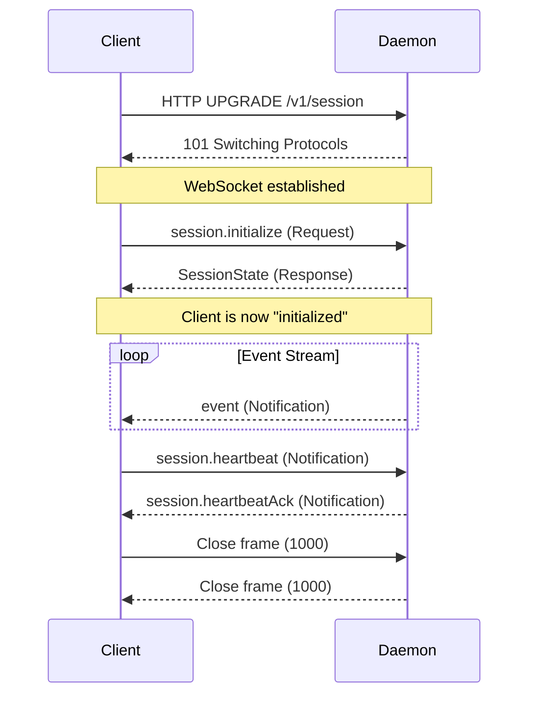

# 01 — Protocol Specification: JSON-RPC 2.0 over WebSocket

> Status: Draft ✅ DECIDED  
> Date: 2026-04-20  
> Scope: Wire format, method namespaces, message lifecycle, error codes

This document defines the complete communication contract between `agent-daemon` and its clients (TUI, CLI, future IDE plugins). All messages are JSON-RPC 2.0 over a single persistent WebSocket connection.

---

## 1. Transport

### 1.1 WebSocket Binding

- **URL**: `ws://127.0.0.1:<port>/v1/session`
- **Port**: Ephemeral (OS-assigned, bound to `0`); advertised in `daemon.json`
- **Subprotocol**: None required for v1. Future versions may negotiate `agent-protocol-v2`.
- **Encoding**: UTF-8 JSON text frames only. Binary frames are rejected with `1003` (unsupported data).

### 1.2 Connection Lifecycle



**Key rules**:
- The daemon **must not** send events before `session.initialize` responds. This prevents race conditions where the client receives deltas before the snapshot.
- If the client sends any other method before `session.initialize`, the daemon replies with error code `-32100` (Session not initialized).
- The daemon may drop idle connections after 120s. The client should send `session.heartbeat` every 30s.

---

## 2. Message Format

### 2.1 JSON-RPC 2.0 Compliance

All messages comply with the [JSON-RPC 2.0 specification](https://www.jsonrpc.org/specification). The implementation uses the standard envelope with these constraints:

- `jsonrpc` field is **required** and must be exactly `"2.0"`.
- `id` is a **string** (not integer) to allow UUID-style request IDs. Example: `"req-a1b2c3d4"`.
- `method` is **required** for Requests and Notifications.
- `params` is **always** an object (`{}` if no parameters), never an array. Named parameters are self-documenting and extensible.
- `result` is **always** an object or `null`.

### 2.2 Message Types by Direction

| Direction | Type | Has `id` | Has `method` | Has `result`/`error` | Purpose |
|-----------|------|----------|--------------|----------------------|---------|
| C→D | Request | ✅ string | ✅ | ❌ | Client asks daemon to do something |
| C→D | Notification | ❌ | ✅ | ❌ | Client tells daemon something (fire-and-forget) |
| D→C | Response | ✅ string | ❌ | ✅ result | Daemon answers a Request |
| D→C | Error Response | ✅ string | ❌ | ✅ error | Daemon reports failure |
| D→C | Notification | ❌ | ✅ | ❌ | Daemon pushes event / asks client |

**No batch requests** for v1. Each WebSocket frame contains exactly one JSON-RPC object. This simplifies parsing and backpressure handling.

### 2.3 Example Messages

**Client Request — initialize session:**

```json
{
  "jsonrpc": "2.0",
  "id": "req-7f8e9d2a",
  "method": "session.initialize",
  "params": {
    "clientType": "tui",
    "clientVersion": "0.9.0"
  }
}
```

**Daemon Response — session state:**

```json
{
  "jsonrpc": "2.0",
  "id": "req-7f8e9d2a",
  "result": {
    "sessionId": "sess-1111-2222",
    "alias": "api-server",
    "appState": { /* ... */ },
    "agents": [ /* ... */ ],
    "workplace": { /* ... */ },
    "focusedAgentId": null
  }
}
```

**Daemon Notification — event push:**

```json
{
  "jsonrpc": "2.0",
  "method": "event",
  "params": {
    "seq": 42,
    "type": "agentSpawned",
    "data": {
      "agentId": "agent-a1b2",
      "codename": "claude-dev",
      "role": "Developer"
    }
  }
}
```

**Daemon Notification — approval request (server-initiated):**

```json
{
  "jsonrpc": "2.0",
  "method": "approval.request",
  "params": {
    "requestId": "apr-99ff",
    "tool": "BashCommand",
    "preview": "git status",
    "timeoutMs": 300000
  }
}
```

**Error Response:**

```json
{
  "jsonrpc": "2.0",
  "id": "req-7f8e9d2a",
  "error": {
    "code": -32101,
    "message": "Agent not found",
    "data": { "agentId": "agent-dead" }
  }
}
```

---

## 3. Method Reference

### 3.1 Namespace Design

Methods are organized by namespace using dot notation:

| Namespace | Owner | Methods |
|-----------|-------|---------|
| `session.*` | Daemon | Connection, lifecycle, heartbeat, focus |
| `agent.*` | Daemon | Spawn, stop, list, status |
| `tool.*` | Daemon | Approve or reject pending tool calls |
| `decision.*` | Daemon | Respond to human decision requests |

Event Notifications use flat method names (`event`, `approval.request`, `decision.request`) because they are not request/response pairs.

### 3.2 `session.initialize` — C→D Request

**Purpose**: Authenticate the client and receive the full session snapshot.

**Params**:

```json
{
  "clientType": "tui" | "cli" | "ide",
  "clientVersion": "string",
  "resumeSnapshotId": "string?"   // Optional: resume from a specific snapshot
}
```

**Result**: `SessionState` object (see §5.1).

**Errors**:
- `-32104`: Workspace not found (daemon config corrupted)
- `-32602`: Invalid params (unknown `clientType`)

**Behavior**:
- On success, the daemon adds the client to its broadcast list.
- The daemon sends the full snapshot. All subsequent state changes are sent as `event` Notifications.
- If `resumeSnapshotId` is provided and valid, the daemon replays events from that snapshot forward before entering live mode.

### 3.3 `session.heartbeat` — C→D Notification

**Purpose**: Keep connection alive and detect stale clients.

**Params**:

```json
{}
```

**Behavior**: Daemon responds with a `session.heartbeatAck` Notification. If no heartbeat is received for 120s, the daemon closes the connection with code `1001` (going away).

### 3.4 `session.sendInput` — C→D Request

**Purpose**: Submit user input (text, command, or special action).

**Params**:

```json
{
  "text": "string",
  "targetAgentId": "string?"   // null = send to focused agent
}
```

**Result**:

```json
{
  "accepted": true,
  "itemId": "item-xyz"
}
```

**Errors**:
- `-32100`: Session not initialized
- `-32101`: Target agent not found

### 3.5 `session.setFocus` — C→D Request

**Purpose**: Change the focused agent (which agent receives input by default).

**Params**:

```json
{
  "agentId": "string?"   // null = clear focus
}
```

**Result**:

```json
{
  "previousAgentId": "string?",
  "currentAgentId": "string?"
}
```

### 3.6 `agent.spawn` — C→D Request

**Purpose**: Create a new agent in the pool.

**Params**:

```json
{
  "provider": "claude" | "codex" | "opencode",
  "role": "Developer" | "ProductOwner" | "ScrumMaster",
  "codename": "string?"
}
```

**Result**: `AgentSnapshot` (see §5.3).

**Errors**:
- `-32602`: Invalid provider or role
- `-32000`: Internal error (provider process spawn failed)

### 3.7 `agent.stop` — C→D Request

**Purpose**: Stop a running agent.

**Params**:

```json
{
  "agentId": "string",
  "force": false   // If true, SIGKILL instead of graceful shutdown
}
```

**Result**:

```json
{
  "stopped": true,
  "agentId": "string"
}
```

**Errors**:
- `-32101`: Agent not found

### 3.8 `agent.list` — C→D Request

**Purpose**: List all agents in the current session.

**Params**:

```json
{
  "includeStopped": false
}
```

**Result**:

```json
{
  "agents": [ /* Array<AgentSnapshot> */ ]
}
```

### 3.9 `tool.approve` — C→D Request

**Purpose**: Approve or reject a pending tool call.

**Params**:

```json
{
  "requestId": "string",
  "allowed": true | false,
  "modifications": {}   // Optional: client-modified arguments
}
```

**Result**:

```json
{
  "resolved": true,
  "requestId": "string"
}
```

**Errors**:
- `-32102`: Tool approval request not found (already resolved or expired)

### 3.10 `decision.respond` — C→D Request

**Purpose**: Respond to a human decision request from the decision layer.

**Params**:

```json
{
  "requestId": "string",
  "choice": "approve" | "reject" | "escalate",
  "reason": "string?"
}
```

**Result**:

```json
{
  "resolved": true,
  "requestId": "string"
}
```

**Errors**:
- `-32103`: Decision request not found

---

## 4. Server-Initiated Notifications

These are Notifications sent by the daemon to the client **without a prior Request**. The client does not reply.

### 4.1 `event` — State Change Notification

**Purpose**: Push an incremental state change to all connected clients.

**Params**:

```json
{
  "seq": 42,           // Monotonically increasing sequence number
  "type": "agentSpawned" | "agentStopped" | "agentStatusChanged" | "itemStarted" | "itemDelta" | "itemCompleted" | "mailReceived" | "error",
  "data": { /* event-specific */ }
}
```

**Sequence numbers**: The `seq` field is a `u64` that starts at `1` for each session and increments by `1` for every event. It is used by clients to detect gaps and request replay (see §6).

**Event types**:

| `type` | `data` Fields | Emitted When |
|--------|--------------|--------------|
| `agentSpawned` | `agentId`, `codename`, `role` | New agent enters pool |
| `agentStopped` | `agentId`, `reason?` | Agent exits pool |
| `agentStatusChanged` | `agentId`, `status` | Agent transitions (idle → running → stopped) |
| `itemStarted` | `itemId`, `kind`, `agentId` | New transcript item begins |
| `itemDelta` | `itemId`, `delta` | Content appended to an in-flight item |
| `itemCompleted` | `itemId`, `item` | Item finalized with full metadata |
| `mailReceived` | `to`, `from`, `subject` | Cross-agent mail delivered |
| `error` | `message`, `source?` | Runtime error not tied to a specific request |

### 4.2 `approval.request` — Human Intervention Needed

**Purpose**: A tool requires human approval before execution.

**Params**:

```json
{
  "requestId": "string",
  "agentId": "string",
  "tool": "string",
  "preview": "string",
  "timeoutMs": 300000
}
```

The client should display a prompt to the user. If the user approves/rejects, the client sends `tool.approve`. If the timeout expires, the daemon auto-rejects.

### 4.3 `decision.request` — Decision Layer Escalation

**Purpose**: The decision layer needs human input.

**Params**:

```json
{
  "requestId": "string",
  "situation": "string",
  "options": ["option1", "option2"],
  "timeoutMs": 600000
}
```

### 4.4 `session.heartbeatAck` — Heartbeat Response

**Purpose**: Acknowledge a client heartbeat.

**Params**:

```json
{
  "serverTime": "2026-04-20T14:30:00Z"
}
```

---

## 5. Data Types

### 5.1 `SessionState`

Sent once on `session.initialize` success. This is the **only** full-state message; everything after is incremental.

```json
{
  "sessionId": "string",
  "alias": "string",
  "serverTime": "2026-04-20T14:30:00Z",
  "lastEventSeq": 42,
  "appState": {
    "transcript": [ /* Array<TranscriptItem> */ ],
    "input": {
      "text": "string",
      "multiline": false
    },
    "status": "idle" | "running" | "waitingForApproval"
  },
  "agents": [ /* Array<AgentSnapshot> */ ],
  "workplace": {
    "id": "string",
    "path": "string",
    "backlog": { /* ... */ },
    "skills": [ /* ... */ ]
  },
  "focusedAgentId": "string?"
}
```

### 5.2 `TranscriptItem`

```json
{
  "id": "string",
  "kind": "userInput" | "assistantOutput" | "toolCall" | "toolResult" | "systemMessage",
  "agentId": "string?",
  "content": "string",
  "metadata": {},
  "createdAt": "2026-04-20T14:30:00Z",
  "completedAt": "2026-04-20T14:30:05Z?"
}
```

### 5.3 `AgentSnapshot`

```json
{
  "id": "string",
  "codename": "string",
  "role": "Developer" | "ProductOwner" | "ScrumMaster",
  "provider": "claude" | "codex" | "opencode",
  "status": "idle" | "running" | "stopped" | "error",
  "currentTaskId": "string?",
  "uptimeSeconds": 120
}
```

---

## 6. Ordering & Replay Guarantees

### 6.1 Event Ordering

Events are delivered in strict `seq` order within a single WebSocket connection. The daemon maintains an outbound queue per client and drains it sequentially.

**Multi-client behavior**: If Client A and Client B are connected to the same daemon, both receive the same events in the same order, but delivery timing may differ due to network latency. The daemon does **not** wait for Client A to acknowledge before sending to Client B.

### 6.2 Gap Detection

If a client detects a gap (`last received seq = 40, next received seq = 43`), it should:

1. Buffer the out-of-order events (43, 44, ...) in a local queue.
2. Send `session.initialize` with `resumeSnapshotId` set to the last known snapshot.
3. The daemon re-sends the snapshot plus replay of events from `seq = 41` forward.
4. The client applies the replay and then drains the buffered queue.

### 6.3 Event Log Persistence

The daemon persists every event to an append-only `events.jsonl` file:

```jsonl
{"seq":1,"time":"2026-04-20T14:00:00Z","type":"agentSpawned","data":{...}}
{"seq":2,"time":"2026-04-20T14:00:01Z","type":"itemStarted","data":{...}}
```

This file is truncated on session shutdown after a snapshot is written. It serves as the replay source for reconnecting clients.

---

## 7. Error Codes

### 7.1 Standard JSON-RPC Codes

| Code | Message | When |
|------|---------|------|
| `-32700` | Parse error | Invalid JSON received |
| `-32600` | Invalid Request | JSON-RPC envelope malformed (missing `jsonrpc`, etc.) |
| `-32601` | Method not found | Unknown method name |
| `-32602` | Invalid params | Params missing required field or wrong type |
| `-32603` | Internal error | Daemon panic or unhandled exception |

### 7.2 Application-Specific Codes

| Code | Message | When |
|------|---------|------|
| `-32100` | Session not initialized | Client sends method before `session.initialize` |
| `-32101` | Agent not found | `agentId` does not exist in pool |
| `-32102` | Tool approval not found | `requestId` for `tool.approve` is stale |
| `-32103` | Decision not found | `requestId` for `decision.respond` is stale |
| `-32104` | Workspace not found | Daemon workplace config corrupted or missing |
| `-32105` | Session already initialized | `session.initialize` called twice on same connection |
| `-32106` | Not supported | Method valid but not supported in current mode (e.g., multi-agent on single-agent session) |

### 7.3 Error Data Convention

Every application error includes a `data` object with structured context:

```json
{
  "code": -32101,
  "message": "Agent not found",
  "data": {
    "agentId": "agent-dead",
    "availableAgents": ["agent-a1b2", "agent-c3d4"]
  }
}
```

This allows clients to show helpful messages ("Agent 'agent-dead' not found. Available: agent-a1b2, agent-c3d4") without string parsing.

---

## 8. Versioning

### 8.1 Protocol Version

The protocol version is independent of crate versions. It is negotiated during `session.initialize`:

```json
{
  "clientType": "tui",
  "clientVersion": "0.9.0",
  "protocolVersion": "1.0.0"
}
```

The daemon responds with the negotiated version:

```json
{
  "result": {
    "sessionId": "...",
    "protocolVersion": "1.0.0"
  }
}
```

If the client requests a version the daemon does not support, the daemon responds with error `-32106` (Not supported) and a `data.supportedVersions` array.

### 8.2 Evolution Rules

- **Patch bump (1.0.x)**: Bug fixes, no schema changes. Clients and servers ignore patch.
- **Minor bump (1.x.0)**: Additive changes (new methods, new event types, new optional fields). Old clients continue to work.
- **Major bump (x.0.0)**: Breaking changes (removed methods, required field changes). Requires explicit client upgrade.

---

## 9. Out of Scope

These are explicitly **not** covered by this specification:

- **Binary payloads** — All data is JSON. Future file-transfer extensions will use a separate mechanism.
- **Compression** — No per-message compression for v1. If needed, enable WebSocket `permessage-deflate` at the transport layer.
- **Authentication** — Single-user localhost only. No tokens, no OAuth.
- **Rate limiting** — Local clients are trusted. Rate limiting may be added in a future version.
- **Multi-machine / LAN** — The WebSocket binds to `127.0.0.1` only. Binding to `0.0.0.0` is a future concern.
