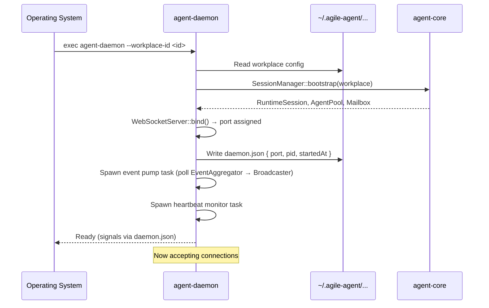
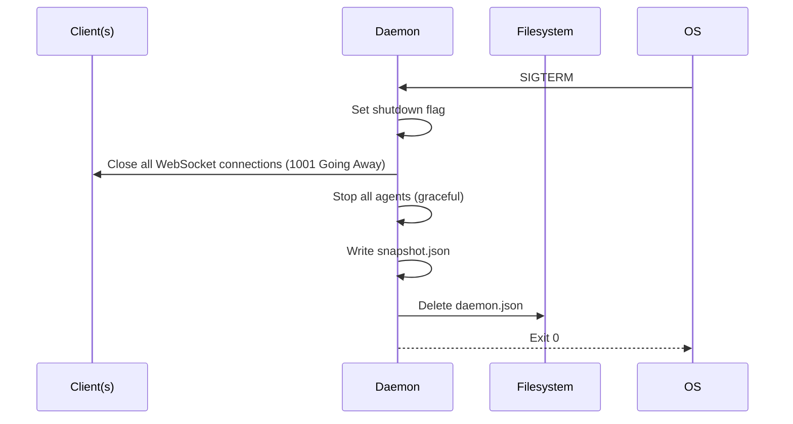

# 03 — agent-daemon Architecture

> Status: Draft ✅ DECIDED  
> Date: 2026-04-20  
> Scope: Crate layout, module boundaries, startup sequence, WebSocket server, session management

This document defines the internal architecture of `agent-daemon` — the per-workspace process that owns runtime state and serves JSON-RPC over WebSocket.

---

## 1. Crate Structure

```
agent/daemon/
├── Cargo.toml
└── src/
    ├── main.rs              # Entry point, CLI args, signal handlers
    ├── lib.rs               # Module declarations, re-exports for tests
    ├── server.rs            # WebSocket server: bind, accept, connection dispatch
    ├── connection.rs        # Per-connection state machine: read, route, write
    ├── router.rs            # JSON-RPC method dispatch table
    ├── handler/             # Method implementations, one per namespace
    │   ├── mod.rs           # Handler trait + dispatcher
    │   ├── session.rs       # session.* methods
    │   ├── agent.rs         # agent.* methods
    │   ├── tool.rs          # tool.* methods
    │   └── decision.rs      # decision.* methods
    ├── session_mgr.rs       # SessionManager: owns RuntimeSession + pool + mailbox
    ├── broadcaster.rs       # EventBroadcaster: fan-out events to all connections
    ├── config.rs            # DaemonConfig, daemon.json read/write
    ├── lifecycle.rs         # Startup, graceful shutdown, snapshot on exit
    └── workplace.rs         # Workplace resolution, auto-link logic
```

**Dependencies** (`Cargo.toml`):

```toml
[package]
name = "agent-daemon"
version = "0.1.0"

[[bin]]
name = "agent-daemon"
path = "src/main.rs"

[dependencies]
tokio = { version = "1", features = ["full"] }
tokio-tungstenite = "0.24"
futures = "0.3"
serde = { version = "1", features = ["derive"] }
serde_json = "1"
tracing = "0.1"
thiserror = "1"

agent-protocol = { path = "../protocol" }
agent-core = { path = "../core" }
agent-types = { path = "../types" }
agent-provider = { path = "../provider" }
agent-storage = { path = "../storage" }
```

**Key rule**: `agent-daemon` is the **only** crate that depends on both `agent-protocol` and `agent-core`. It is the adapter layer between the domain library and the wire protocol.

---

## 2. Module Design

### 2.1 server.rs — WebSocket Server

```rust
// agent/daemon/src/server.rs

use std::net::SocketAddr;
use tokio::net::{TcpListener, TcpStream};
use tokio_tungstenite::accept_async;

/// Binds to an ephemeral port and accepts WebSocket connections.
pub struct WebSocketServer {
    listener: TcpListener,
    local_addr: SocketAddr,
}

impl WebSocketServer {
    pub async fn bind() -> anyhow::Result<Self> {
        let listener = TcpListener::bind("127.0.0.1:0").await?;
        let local_addr = listener.local_addr()?;
        Ok(Self { listener, local_addr })
    }

    pub fn local_addr(&self) -> SocketAddr {
        self.local_addr
    }

    pub async fn run<F>(self, mut on_connect: F) -> anyhow::Result<()>
    where
        F: FnMut(TcpStream, SocketAddr) + Send + 'static,
    {
        loop {
            let (stream, addr) = self.listener.accept().await?;
            on_connect(stream, addr);
        }
    }
}
```

**Design notes**:
- Bind to `127.0.0.1:0` for ephemeral port. The OS assigns the port.
- No TLS for v1 (localhost only).
- Each accepted `TcpStream` is handed off to `Connection::spawn()`.
- The server loop runs until the shutdown signal is received.

### 2.2 connection.rs — Per-Connection State Machine

```rust
// agent/daemon/src/connection.rs

use agent_protocol::jsonrpc::*;
use agent_protocol::methods::*;
use agent_protocol::events::Event;
use futures::{SinkExt, StreamExt};
use tokio::sync::mpsc;
use tokio_tungstenite::tungstenite::Message;

/// Represents a single client connection.
pub struct Connection {
    id: String,
    addr: std::net::SocketAddr,
    state: ConnectionState,
    /// Channel for sending events to this connection.
    event_tx: mpsc::UnboundedSender<JsonRpcNotification>,
}

#[derive(Debug, Clone, Copy, PartialEq, Eq)]
enum ConnectionState {
    Connected,      // WebSocket open, waiting for initialize
    Initialized,    // session.initialize succeeded
    Closing,
}

impl Connection {
    pub fn spawn(
        stream: tokio::net::TcpStream,
        addr: std::net::SocketAddr,
        router: RouterHandle,
        broadcaster: BroadcasterHandle,
    ) {
        tokio::spawn(async move {
            let ws_stream = tokio_tungstenite::accept_async(stream).await?;
            let (mut write, mut read) = ws_stream.split();
            let (event_tx, mut event_rx) = mpsc::unbounded_channel();

            let mut conn = Connection {
                id: format!("conn-{}", uuid::Uuid::new_v4()),
                addr,
                state: ConnectionState::Connected,
                event_tx,
            };

            // Register with broadcaster so this connection receives events.
            broadcaster.register(conn.id.clone(), conn.event_tx.clone());

            loop {
                tokio::select! {
                    // Read JSON-RPC messages from client
                    Some(Ok(msg)) = read.next() => {
                        if let Message::Text(text) = msg {
                            match conn.handle_message(&text, &router).await {
                                Ok(Some(response)) => {
                                    let json = serde_json::to_string(&response)?;
                                    write.send(Message::Text(json)).await?;
                                }
                                Ok(None) => {} // Notification, no response
                                Err(e) => {
                                    let error = JsonRpcErrorResponse {
                                        jsonrpc: "2.0".to_string(),
                                        id: RequestId::String(conn.id.clone()), // TODO: extract real id
                                        error: e.into(),
                                    };
                                    let json = serde_json::to_string(&error)?;
                                    write.send(Message::Text(json)).await?;
                                }
                            }
                        }
                    }

                    // Send pending events to client
                    Some(notification) = event_rx.recv() => {
                        let json = serde_json::to_string(&notification)?;
                        write.send(Message::Text(json)).await?;
                    }
                }
            }

            // Cleanup
            broadcaster.unregister(&conn.id);
            Ok::<(), anyhow::Error>(())
        });
    }

    async fn handle_message(
        &mut self,
        text: &str,
        router: &RouterHandle,
    ) -> anyhow::Result<Option<JsonRpcMessage>> {
        let msg: JsonRpcMessage = serde_json::from_str(text)?;
        match msg {
            JsonRpcMessage::Request(req) => {
                if self.state == ConnectionState::Connected && req.method != "session.initialize" {
                    return Ok(Some(JsonRpcMessage::Error(JsonRpcErrorResponse {
                        jsonrpc: "2.0".to_string(),
                        id: req.id,
                        error: ProtocolError::SessionNotInitialized.into(),
                    })));
                }
                let response = router.dispatch(req).await?;
                if req.method == "session.initialize" && response.is_success() {
                    self.state = ConnectionState::Initialized;
                }
                Ok(Some(JsonRpcMessage::Response(response)))
            }
            JsonRpcMessage::Notification(notif) => {
                router.dispatch_notification(notif).await?;
                Ok(None)
            }
            _ => {
                // Client should not send Response or Error
                Err(anyhow::anyhow!("Invalid message direction"))
            }
        }
    }
}
```

**Design notes**:
- Each connection gets its own `event_rx` channel. The `Broadcaster` holds `event_tx` handles.
- `session.initialize` gate: No method except `session.initialize` is accepted before initialization.
- Errors during message handling produce an immediate JSON-RPC Error Response.
- The connection loop exits on WebSocket close, read error, or write error.

### 2.3 router.rs — Method Dispatch

```rust
// agent/daemon/src/router.rs

use agent_protocol::jsonrpc::*;
use agent_protocol::methods::*;
use std::collections::HashMap;
use std::sync::Arc;

pub type MethodHandler = Arc<
    dyn Fn(JsonRpcRequest) -> futures::future::BoxFuture<'static, anyhow::Result<JsonRpcResponse>>
        + Send
        + Sync,
>;

pub struct Router {
    handlers: HashMap<String, MethodHandler>,
}

pub struct RouterHandle {
    inner: Arc<Router>,
}

impl RouterHandle {
    pub async fn dispatch(&self, req: JsonRpcRequest) -> anyhow::Result<JsonRpcResponse> {
        match self.inner.handlers.get(&req.method) {
            Some(handler) => handler(req).await,
            None => Ok(JsonRpcResponse {
                jsonrpc: "2.0".to_string(),
                id: req.id,
                result: None,
            }),
        }
    }

    pub async fn dispatch_notification(
        &self,
        notif: JsonRpcNotification,
    ) -> anyhow::Result<()> {
        // Notifications that require handling (e.g., heartbeat)
        // Fire-and-forget notifications are no-ops at the router level.
        Ok(())
    }
}
```

**Registration pattern** (in `main.rs` or `lib.rs`):

```rust
let mut router = Router::new();
router.register("session.initialize", Arc::new(|req| {
    Box::pin(async move {
        let params: InitializeParams = parse_params(&req)?;
        let result = session_mgr.initialize(params).await?;
        Ok(JsonRpcResponse {
            jsonrpc: "2.0".to_string(),
            id: req.id,
            result: Some(serde_json::to_value(result)?),
        })
    })
}));
// ... register other methods
```

**Alternative (type-safe)**: Instead of `MethodHandler` as a type-erased closure, define a trait:

```rust
#[async_trait::async_trait]
pub trait Handler: Send + Sync {
    async fn handle(&self, req: JsonRpcRequest) -> anyhow::Result<JsonRpcResponse>;
}
```

This is more verbose but eliminates `BoxFuture` overhead and allows handler structs to hold references to `SessionManager`. **Recommended for v1**.

### 2.4 session_mgr.rs — The State Owner

```rust
// agent/daemon/src/session_mgr.rs

use agent_core::agent_runtime::AgentRuntime;
use agent_core::agent_pool::AgentPool;
use agent_core::app::AppState;
use agent_core::event_aggregator::EventAggregator;
use agent_core::mailbox::AgentMailbox;
use std::sync::Arc;
use tokio::sync::RwLock;

/// The single owner of all runtime state.
///
/// This struct is what `TuiState` currently holds in the TUI. After migration,
/// it lives here, behind an `Arc<RwLock<>>` for shared access by handlers.
pub struct SessionManager {
    app_state: Arc<RwLock<AppState>>,
    agent_pool: Arc<RwLock<AgentPool>>,
    event_aggregator: EventAggregator,
    mailbox: Arc<RwLock<AgentMailbox>>,
    runtime: AgentRuntime,
}

impl SessionManager {
    pub async fn bootstrap(workplace: &Workplace) -> anyhow::Result<Self> {
        // Mirrors the current TuiState::bootstrap() logic.
        let app_state = AppState::load_or_default(workplace).await?;
        let runtime = AgentRuntime::new(&app_state.config)?;
        let agent_pool = AgentPool::new(runtime.clone());
        let event_aggregator = EventAggregator::new();
        let mailbox = AgentMailbox::new();

        Ok(Self {
            app_state: Arc::new(RwLock::new(app_state)),
            agent_pool: Arc::new(RwLock::new(agent_pool)),
            event_aggregator,
            mailbox: Arc::new(RwLock::new(mailbox)),
            runtime,
        })
    }

    pub async fn initialize(&self, params: InitializeParams) -> anyhow::Result<SessionState> {
        // Return snapshot of current state
        let app_state = self.app_state.read().await;
        let agents = self.agent_pool.read().await;
        // ... build SessionState from core types
        Ok(SessionState { /* ... */ })
    }

    pub async fn spawn_agent(&self, params: AgentSpawnParams) -> anyhow::Result<AgentSnapshot> {
        let mut pool = self.agent_pool.write().await;
        // ... delegate to pool
        Ok(AgentSnapshot { /* ... */ })
    }

    // ... other methods
}
```

**Design notes**:
- `SessionManager` is the **only** place that directly touches `agent_core` types.
- It translates between `agent_core` domain types and `agent_protocol` wire types.
- Internal concurrency: `RwLock` for read-heavy state (`AppState`, `AgentPool`), `Mutex` for write-heavy operations.
- The `EventAggregator` from core is consumed here, but its events are **not** read by the TUI directly. Instead, a background task polls the aggregator and feeds events into the `Broadcaster`.

### 2.5 broadcaster.rs — Event Fan-Out

```rust
// agent/daemon/src/broadcaster.rs

use agent_protocol::events::Event;
use agent_protocol::jsonrpc::*;
use std::collections::HashMap;
use tokio::sync::mpsc;

/// Broadcasts events to all connected clients.
pub struct EventBroadcaster {
    connections: HashMap<String, mpsc::UnboundedSender<JsonRpcNotification>>,
}

pub struct BroadcasterHandle {
    inner: std::sync::Arc<tokio::sync::RwLock<EventBroadcaster>>,
}

impl BroadcasterHandle {
    pub fn register(&self, conn_id: String, tx: mpsc::UnboundedSender<JsonRpcNotification>) {
        // ... add to map
    }

    pub fn unregister(&self, conn_id: &str) {
        // ... remove from map
    }

    pub async fn broadcast(&self, event: Event) {
        let notification = JsonRpcNotification {
            jsonrpc: "2.0".to_string(),
            method: "event".to_string(),
            params: Some(serde_json::to_value(&event).unwrap()),
        };

        let conns = self.inner.read().await;
        for (conn_id, tx) in &conns.connections {
            if let Err(_) = tx.send(notification.clone()) {
                // Channel closed — connection dropped. Cleanup happens on disconnect.
                tracing::warn!("Failed to send event to {}", conn_id);
            }
        }
    }
}
```

**Design notes**:
- `broadcast()` is non-blocking. If a client's channel is full, the event is dropped for that client (the client will detect the gap and re-sync).
- Event ordering is guaranteed per-connection because each connection has a single `mpsc` channel fed by this broadcaster.
- Sequence numbers are assigned by the daemon, not the broadcaster. The `SessionManager` maintains a `seq_counter: AtomicU64`.

---

## 3. Startup Sequence



### 3.1 Startup Arguments

```rust
#[derive(clap::Parser)]
struct DaemonArgs {
    /// Workplace UUID this daemon serves.
    #[arg(long)]
    workplace_id: String,

    /// Optional session alias.
    #[arg(long)]
    alias: Option<String>,

    /// Write logs to file instead of stderr.
    #[arg(long)]
    log_file: Option<std::path::PathBuf>,
}
```

The daemon is **not** launched directly by users. It is spawned by the CLI/TUI via `auto-link` logic (IMP-09 §2).

### 3.2 daemon.json Format

```json
{
  "version": 1,
  "pid": 12345,
  "websocketUrl": "ws://127.0.0.1:49231/v1/session",
  "workplaceId": "wp-a1b2-c3d4",
  "alias": "api-server",
  "startedAt": "2026-04-20T14:30:00Z",
  "lastHeartbeat": "2026-04-20T14:35:00Z"
}
```

- `version`: Schema version of daemon.json. Currently `1`.
- `pid`: Daemon process ID. Used by clients to detect zombie configs.
- `websocketUrl`: Full WebSocket URL including path.
- `lastHeartbeat`: Updated by the daemon every 30s. Clients check this to detect stale configs.

---

## 4. Graceful Shutdown



### 4.1 Shutdown Behavior

1. **Signal handling**: `tokio::signal::ctrl_c()` and `tokio::signal::unix::signal(SignalKind::terminate())`.
2. **Connection drain**: Send close frame `1001` to all clients. Wait up to 5s for graceful close.
3. **Agent shutdown**: Call `AgentPool::shutdown()` to stop all agents.
4. **Snapshot write**: Serialize `SessionState` to `.agile-agent/snapshot.json`.
5. **Config cleanup**: Delete `daemon.json` so future clients know the daemon is gone.
6. **Exit code**: `0` for clean shutdown, `1` for error.

### 4.2 Snapshot Format

```json
{
  "version": 1,
  "sessionId": "sess-1111-2222",
  "alias": "api-server",
  "writtenAt": "2026-04-20T14:30:00Z",
  "lastEventSeq": 42,
  "state": { /* SessionState object */ }
}
```

On startup, if `snapshot.json` exists and `resumeSnapshotId` is not provided, the daemon loads it and replays events from `events.jsonl` starting at `lastEventSeq + 1`.

---

## 5. Event Pump: Bridging Core and Protocol

The daemon runs a background task that bridges `agent_core`'s `EventAggregator` (mpsc-based) with the `EventBroadcaster` (WebSocket-based):

```rust
// agent/daemon/src/event_pump.rs

use agent_core::event_aggregator::ProviderEvent;
use agent_protocol::events::*;

pub async fn run_event_pump(
    mut aggregator_rx: mpsc::Receiver<ProviderEvent>,
    broadcaster: BroadcasterHandle,
    seq_counter: Arc<AtomicU64>,
) {
    while let Some(provider_event) = aggregator_rx.recv().await {
        let seq = seq_counter.fetch_add(1, Ordering::SeqCst) + 1;
        let event = convert_provider_event(provider_event, seq);
        broadcaster.broadcast(event).await;
    }
}

fn convert_provider_event(pe: ProviderEvent, seq: u64) -> Event {
    let payload = match pe {
        ProviderEvent::ExecCommandStarted { agent_id, cmd } => {
            EventPayload::ItemStarted(ItemStartedData {
                item_id: generate_item_id(),
                kind: ItemKind::ToolCall,
                agent_id,
            })
        }
        ProviderEvent::OutputDelta { content } => {
            EventPayload::ItemDelta(ItemDeltaData {
                item_id: current_item_id(), // track in-flight items
                delta: ItemDelta::Text(content),
            })
        }
        ProviderEvent::Finished { result } => {
            EventPayload::ItemCompleted(ItemCompletedData {
                item_id: current_item_id(),
                item: TranscriptItem { /* ... */ },
            })
        }
        // ... all other variants
    };
    Event { seq, payload }
}
```

**Design notes**:
- This is the **only** place that maps `ProviderEvent` to `Event`. Centralized, testable, versioned.
- `generate_item_id()` and `current_item_id()` require tracking in-flight items. A `HashMap<AgentId, ItemId>` in the pump state suffices.
- Events are persisted to `events.jsonl` **before** broadcasting, so a crash after persistence but before broadcast is safe (clients re-sync on reconnect).

---

## 6. Concurrency Model

```mermaid
flowchart TD
    subgraph DaemonProcess["Daemon Process (tokio runtime)"]
        WS["WebSocket Server Task<br/>(TCP accept loop)"]
        C1["Connection Task #1"]
        C2["Connection Task #2"]
        SM["SessionManager<br/>(Arc&lt;RwLock&lt;AppState&gt;&gt;,<br/>Arc&lt;RwLock&lt;AgentPool&gt;&gt;)"]
        EP["Event Pump Task<br/>(mpsc → broadcaster)"]
        HB["Heartbeat Task<br/>(30s interval)"]
        BC["Broadcaster<br/>(HashMap&lt;conn_id, mpsc::Sender&gt;)"]
    end

    PT1["Provider Thread #1"]
    PT2["Provider Thread #2"]

    PT1 -->|mpsc| EP
    PT2 -->|mpsc| EP
    EP -->|Event| BC
    BC -->|Notification| C1
    BC -->|Notification| C2
    C1 -->|JSON-RPC Request| SM
    C2 -->|JSON-RPC Request| SM
    WS -->|TcpStream| C1
    WS -->|TcpStream| C2
```



**Concurrency rules**:
- `SessionManager` state is protected by `tokio::sync::RwLock`. Read-heavy operations (status queries) use `read()`. Write-heavy operations (spawn, stop) use `write()`.
- Each `Connection` task owns its WebSocket write half. No shared WebSocket state.
- The `Broadcaster` holds `mpsc::UnboundedSender` handles. Sending is non-blocking.
- The `EventPump` task is the **only** consumer of `EventAggregator`'s mpsc channel.

---

## 7. Testing Strategy (Preview)

Full testing strategy is in IMP-08. Key points for daemon architecture:

- **In-memory WebSocket**: Use `tokio::io::duplex()` to create a fake TCP stream, wrap it in `tokio-tungstenite`.
- **Mock SessionManager**: Define a `SessionManager` trait with async methods. The real impl uses `agent_core`; test impls use in-memory state.
- **Event pump testing**: Feed `ProviderEvent` values into a mock `EventAggregator` and assert the emitted `Event` notifications.

```rust
#[tokio::test]
async fn test_spawn_agent_broadcasts_event() {
    let (daemon, mut client_ws) = setup_test_daemon().await;

    // Client sends session.initialize
    client_ws.send_initialize().await;
    let snapshot = client_ws.recv_response().await;

    // Client sends agent.spawn
    client_ws.send_request("agent.spawn", json!({"provider":"claude","role":"Developer"})).await;
    let _response = client_ws.recv_response().await;

    // Assert event notification was broadcast
    let event = client_ws.recv_notification().await;
    assert_eq!(event.method, "event");
    assert_eq!(event.params["type"], "agentSpawned");
}
```

---

## 8. Anti-Patterns to Avoid

| Anti-Pattern | Why It's Bad | What We Do Instead |
|--------------|-------------|-------------------|
| Holding `Mutex<AppState>` across await points | Blocks the runtime | Use `RwLock`, drop guards before await |
| Blocking the event pump with I/O | Delays all events | Persist to `events.jsonl` in a separate task, feed the pump via channel |
| `unwrap()` in request handlers | Crashes the daemon on bad input | Return JSON-RPC Error Response |
| Storing `Connection` state in a global static | Untestable, hard to reason about | Pass `Arc<SessionManager>` and `BroadcasterHandle` to handlers |
| Letting core events escape unmapped | Protocol leaks internal types | Centralized `convert_provider_event()` in event pump |
