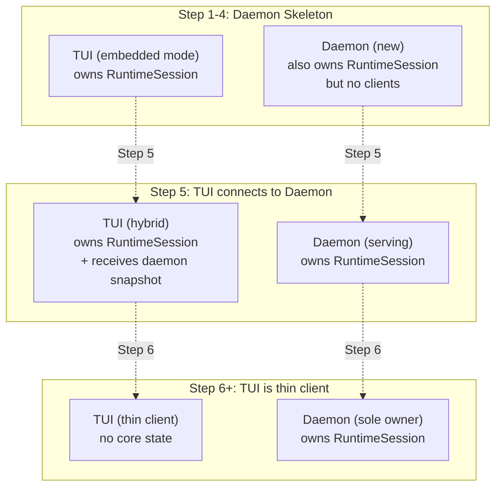

# 04 — State Migration: From TUI to Daemon

> Status: Draft ✅ DECIDED  
> Date: 2026-04-20  
> Scope: Moving runtime state ownership out of TUI, defining what stays and what goes

This document defines the concrete migration of state ownership from `TuiState` (in `agent-tui`) to `SessionManager` (in `agent-daemon`). It is the most technically complex phase because it touches the deepest coupling point.

---

## 1. Current State: What TuiState Owns

From IMP audit (`../tui-core-interface-audit.md` §3), `TuiState` currently embeds:

```rust
// agent/tui/src/ui_state.rs (current)

pub struct TuiState {
    // === RUNTIME STATE (must move to daemon) ===
    pub session: RuntimeSession,           // AppState + workplace + config
    pub agent_pool: Option<AgentPool>,     // All agent slots
    pub event_aggregator: EventAggregator, // mpsc receivers from providers
    pub mailbox: AgentMailbox,             // Cross-agent mail queue

    // === PURE TUI STATE (stays in TUI) ===
    pub scroll: ScrollState,
    pub composer: ComposerState,
    pub focused_agent_id: Option<AgentId>,
    pub overlays: Vec<Overlay>,
    pub theme: Theme,

    // === DERIVED STATE (computed from events) ===
    pub transcript: Vec<TranscriptEntry>,
    pub status_line: String,
}
```

**The rule**: If a field is needed by the CLI (or any non-TUI client), it belongs in the daemon. If it is purely about rendering, it stays in the TUI.

---

## 2. Migration Matrix

| Field | Current Owner | New Owner | Rationale |
|-------|--------------|-----------|-----------|
| `session` (`RuntimeSession`) | TUI | Daemon | CLI needs workplace state |
| `agent_pool` (`Option<AgentPool>`) | TUI | Daemon | CLI needs to list/spawn/stop agents |
| `event_aggregator` (`EventAggregator`) | TUI | Daemon | All events originate in core runtime |
| `mailbox` (`AgentMailbox`) | TUI | Daemon | Cross-agent mail is runtime logic |
| `scroll` (`ScrollState`) | TUI | **TUI** | Pure rendering concern |
| `composer` (`ComposerState`) | TUI | **TUI** | Pure input UI concern |
| `focused_agent_id` | TUI | **TUI** | Per-client view state; each TUI may focus differently |
| `overlays` (`Vec<Overlay>`) | TUI | **TUI** | Pure UI state |
| `theme` (`Theme`) | TUI | **TUI** | Pure rendering concern |
| `transcript` (`Vec<TranscriptEntry>`) | TUI | **TUI** | Reconstructed from events; each client builds its own |
| `status_line` (`String`) | TUI | **TUI** | Derived from agent status + connection state |

**Key insight**: `focused_agent_id` stays in the TUI. Multiple TUIs connected to the same daemon may want to focus on different agents. The daemon has a "default focus" (e.g., most recently active agent), but each client can override locally.

---

## 3. The New TuiState

After migration, `TuiState` becomes a **pure render state machine**:

```rust
// agent/tui/src/ui_state.rs (target)

use agent_protocol::state::{SessionState, AgentSnapshot, TranscriptItem};
use agent_protocol::events::Event;

pub struct TuiState {
    // === CONNECTION STATE ===
    pub connection: ConnectionState,       // Connected / Disconnected / Reconnecting
    pub session: Option<SessionState>,     // Snapshot from daemon (None until initialized)

    // === RENDER STATE (rebuilt from events) ===
    pub transcript: Vec<TranscriptItem>,
    pub agents: Vec<AgentSnapshot>,

    // === PURE TUI STATE ===
    pub scroll: ScrollState,
    pub composer: ComposerState,
    pub focused_agent_id: Option<String>,
    pub overlays: Vec<Overlay>,
    pub theme: Theme,
}

#[derive(Debug, Clone, Copy, PartialEq, Eq)]
pub enum ConnectionState {
    Disconnected,
    Connecting,
    Connected,
    Reconnecting,
}
```

**No `agent_core` imports**. Every field comes from `agent_protocol` or is purely local.

### 3.1 Event Application

The TUI applies events to rebuild its render state:

```rust
impl TuiState {
    pub fn apply_event(&mut self, event: &Event) {
        match &event.payload {
            EventPayload::AgentSpawned(data) => {
                self.agents.push(AgentSnapshot {
                    id: data.agent_id.clone(),
                    codename: data.codename.clone(),
                    role: data.role.clone(),
                    // ...
                });
            }
            EventPayload::AgentStopped(data) => {
                self.agents.retain(|a| a.id != data.agent_id);
            }
            EventPayload::ItemStarted(data) => {
                self.transcript.push(TranscriptItem {
                    id: data.item_id.clone(),
                    kind: data.kind,
                    agent_id: Some(data.agent_id.clone()),
                    content: String::new(),
                    // ...
                });
            }
            EventPayload::ItemDelta(data) => {
                if let Some(item) = self.transcript.iter_mut().find(|i| i.id == data.item_id) {
                    item.content.push_str(&data.delta.text);
                }
            }
            EventPayload::ItemCompleted(data) => {
                if let Some(item) = self.transcript.iter_mut().find(|i| i.id == data.item_id) {
                    *item = data.item.clone();
                }
            }
            // ... other variants
        }
    }
}
```

This is the TUI-side equivalent of the daemon's `convert_provider_event()`. Both sides agree on the event semantics because they share the `Event` type from `agent-protocol`.

---

## 4. SessionManager: The New Owner

```rust
// agent/daemon/src/session_mgr.rs (target)

use agent_core::agent_runtime::AgentRuntime;
use agent_core::agent_pool::AgentPool;
use agent_core::app::AppState;
use agent_core::event_aggregator::EventAggregator;
use agent_core::mailbox::AgentMailbox;
use std::sync::atomic::{AtomicU64, Ordering};
use std::sync::Arc;
use tokio::sync::RwLock;

/// Owns all runtime state. The single source of truth.
pub struct SessionManager {
    // Core domain objects (from agent_core)
    app_state: Arc<RwLock<AppState>>,
    agent_pool: Arc<RwLock<AgentPool>>,
    event_aggregator: EventAggregator,
    mailbox: Arc<RwLock<AgentMailbox>>,
    runtime: AgentRuntime,

    // Daemon-local state
    seq_counter: AtomicU64,
    workplace: Workplace,
}

impl SessionManager {
    /// Bootstraps the session from workplace config.
    /// Mirrors TuiState::bootstrap() from the current TUI.
    pub async fn bootstrap(workplace: Workplace) -> anyhow::Result<Self> {
        let app_state = AppState::load_or_default(&workplace).await?;
        let runtime = AgentRuntime::new(&app_state.config)?;
        let agent_pool = AgentPool::new(runtime.clone());
        let event_aggregator = EventAggregator::new();
        let mailbox = AgentMailbox::new();

        Ok(Self {
            app_state: Arc::new(RwLock::new(app_state)),
            agent_pool: Arc::new(RwLock::new(agent_pool)),
            event_aggregator,
            mailbox: Arc::new(RwLock::new(mailbox)),
            runtime,
            seq_counter: AtomicU64::new(1),
            workplace,
        })
    }

    /// Returns a snapshot of current state for new clients.
    pub async fn snapshot(&self) -> SessionState {
        let app_state = self.app_state.read().await;
        let agents = self.agent_pool.read().await;

        SessionState {
            session_id: self.workplace.session_id.clone(),
            alias: self.workplace.alias.clone(),
            server_time: chrono::Utc::now().to_rfc3339(),
            last_event_seq: self.seq_counter.load(Ordering::SeqCst) - 1,
            app_state: AppStateSnapshot {
                transcript: app_state.transcript.iter().map(into_transcript_item).collect(),
                input: InputState { text: app_state.input.text.clone(), multiline: app_state.input.multiline },
                status: map_session_status(&app_state.status),
            },
            agents: agents.slots.iter().map(into_agent_snapshot).collect(),
            workplace: WorkplaceSnapshot {
                id: self.workplace.id.clone(),
                path: self.workplace.path.clone(),
                backlog: map_backlog(&app_state.backlog),
                skills: map_skills(&app_state.skills),
            },
            focused_agent_id: None, // Per-client, not session-wide
            protocol_version: agent_protocol::PROTOCOL_VERSION.to_string(),
        }
    }

    // --- Method handlers (called by router) ---

    pub async fn spawn_agent(&self, params: AgentSpawnParams) -> anyhow::Result<AgentSnapshot> {
        let mut pool = self.agent_pool.write().await;
        let slot = pool.spawn(params.provider, params.role, params.codename).await?;
        Ok(into_agent_snapshot(&slot))
    }

    pub async fn stop_agent(&self, params: AgentStopParams) -> anyhow::Result<AgentStopResult> {
        let mut pool = self.agent_pool.write().await;
        pool.stop(&params.agent_id, params.force).await?;
        Ok(AgentStopResult { stopped: true, agent_id: params.agent_id })
    }

    pub async fn send_input(&self, params: SendInputParams) -> anyhow::Result<SendInputResult> {
        let mut app_state = self.app_state.write().await;
        let target = params.target_agent_id
            .or_else(|| self.get_default_focus().await)
            .ok_or_else(|| anyhow::anyhow!("No target agent"))?;

        let item_id = app_state.submit_input(&params.text, &target).await?;
        Ok(SendInputResult { accepted: true, item_id })
    }

    // ... other handlers
}
```

### 4.1 Mapping Functions

The `SessionManager` contains **private** mapping functions that translate `agent_core` types to `agent_protocol` types. These are the adapter layer:

```rust
fn into_transcript_item(entry: &agent_core::transcript::TranscriptEntry) -> TranscriptItem {
    TranscriptItem {
        id: entry.id.clone(),
        kind: map_item_kind(entry.kind),
        agent_id: entry.agent_id.clone(),
        content: entry.content.clone(),
        metadata: serde_json::to_value(&entry.metadata).unwrap_or_default(),
        created_at: entry.created_at.to_rfc3339(),
        completed_at: entry.completed_at.map(|t| t.to_rfc3339()),
    }
}

fn into_agent_snapshot(slot: &agent_core::agent_slot::AgentSlot) -> AgentSnapshot {
    AgentSnapshot {
        id: slot.id.clone(),
        codename: slot.codename.clone(),
        role: format!("{:?}", slot.role), // Or use a proper mapping
        provider: format!("{:?}", slot.provider.kind()),
        status: map_slot_status(slot.status),
        current_task_id: slot.current_task.as_ref().map(|t| t.id.clone()),
        uptime_seconds: slot.uptime().as_secs(),
    }
}
```

These functions are **intentionally dumb** — they do not contain business logic. If `agent_core` changes its internal representation, only these mappers need updating.

---

## 5. Migration Steps

### Step 1: Extract `SessionManager` skeleton in daemon

Create `agent/daemon/src/session_mgr.rs` with the struct definition and `bootstrap()` method. Do **not** move any logic from TUI yet — just create the type and make it compile.

**Success criteria**: `cargo build -p agent-daemon` compiles with `SessionManager` defined.

### Step 2: Duplicate bootstrap logic

Copy `TuiState::bootstrap()` logic into `SessionManager::bootstrap()`. At this point, both TUI and daemon have their own bootstrap paths. This is intentional — we keep TUI working while building the daemon.

**Success criteria**: `SessionManager::bootstrap()` produces a valid `AppState` and `AgentPool`.

### Step 3: Implement snapshot generation

Implement `SessionManager::snapshot()` to produce a `SessionState`. Add a test that bootstraps a session, calls `snapshot()`, and asserts the returned JSON round-trips.

**Success criteria**: `SessionManager::snapshot()` returns valid `SessionState`; test passes.

### Step 4: Wire snapshot into `session.initialize` handler

When a client calls `session.initialize`, the daemon responds with `SessionManager::snapshot()` instead of a hardcoded empty state.

**Success criteria**: A test client calling `session.initialize` receives a non-empty snapshot.

### Step 5: TUI receives snapshot on connect

Modify TUI to connect to daemon via WebSocket, send `session.initialize`, and populate `TuiState::session` from the response. At this stage, the TUI still owns its own `RuntimeSession` — it just also receives the daemon's snapshot. This is the "dual state" transition period.

**Success criteria**: TUI opens, connects to daemon, and displays the correct session alias.

### Step 6: TUI stops bootstrapping its own session

Remove `RuntimeSession`, `AgentPool`, `EventAggregator`, and `Mailbox` from `TuiState`. The TUI no longer calls `bootstrap()`. It relies entirely on the daemon for runtime state.

**Success criteria**: `TuiState` has no `agent_core` fields; `cargo build -p agent-tui` compiles.

### Step 7: Remove TUI's direct core imports

Delete all `use agent_core::*` statements from `tui/src`. Replace method calls with `ClientMsg` sends over WebSocket.

**Success criteria**: `cargo build -p agent-tui` compiles with no `agent-core` dependency in `tui/Cargo.toml`.

---

## 6. Backward Compatibility During Migration

During Steps 1–5, the TUI still works in "embedded mode" (direct core ownership). The daemon runs in parallel but is not yet the source of truth. This is the "dual state" period.



This gradual approach means:
- **No big-bang refactor**: Each step is independently testable.
- **Rollback safety**: If a step breaks, revert to the previous step.
- **Feature parity**: The TUI is never non-functional during migration.

---

## 7. Edge Cases

### 7.1 TUI Connects Before Daemon Is Ready

The auto-link mechanism (IMP-09 §2) retries with exponential backoff. If the daemon is still bootstrapping, the client waits and retries.

### 7.2 Daemon Crashes While TUI Is Connected

TUI detects the WebSocket close (or heartbeat timeout) and enters `ConnectionState::Reconnecting`. It attempts to re-connect, receives a new snapshot, and replays any missed events.

### 7.3 Multiple TUIs Focus Different Agents

Each TUI maintains its own `focused_agent_id` locally. When a TUI sends `session.sendInput` without `target_agent_id`, the daemon uses the **daemon's** default focus (most recently active agent), not any specific TUI's focus. If a TUI wants to send to its focused agent, it must explicitly include `target_agent_id`.

### 7.4 Snapshot Size

A long session may have a large transcript. The snapshot could be megabytes. Mitigations:
- Snapshot includes only the last N transcript items (e.g., 1000). Older items are loaded on demand via a future `session.loadHistory` method.
- Or: Snapshot is compressed (future concern).
- For v1, send the full snapshot. If size becomes a problem, add pagination later.
