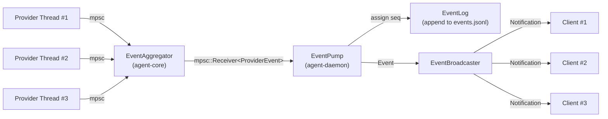

# 05 — Event Streaming Implementation

> Status: Draft ✅ DECIDED  
> Date: 2026-04-20  
> Scope: ProviderEvent → Event conversion, broadcast, ordering, replay, gap recovery

This document defines how events flow from provider threads through the daemon to all connected clients. It covers the conversion layer, the broadcast mechanism, and the recovery protocol for missed events.

---

## 1. Event Flow Overview



**Key properties**:
- **Single consumer**: Only the `EventPump` reads from `EventAggregator`.
- **Ordered**: Events receive monotonic `seq` numbers in the order they are consumed.
- **Persistent**: Every event is appended to `events.jsonl` before broadcasting.
- **Best-effort delivery**: A slow client may drop events (full channel). It recovers via replay.

---

## 2. ProviderEvent → Event Conversion

### 2.1 Conversion Table

| `ProviderEvent` | `Event` type | Notes |
|-----------------|-------------|-------|
| `ExecCommandStarted { agent_id, cmd }` | `ItemStarted { kind: ToolCall }` | Tool call begins |
| `OutputDelta { agent_id, content }` | `ItemDelta { delta: Text }` | Streaming output |
| `ToolCallRequested { agent_id, tool, args }` | `ItemStarted { kind: ToolCall }` + `ApprovalRequest` notification | Tool needs approval |
| `Finished { agent_id, result }` | `ItemCompleted` | Item finalized |
| `AgentSpawned { agent_id, codename, role }` | `AgentSpawned` | New agent in pool |
| `AgentStopped { agent_id, reason }` | `AgentStopped` | Agent removed |
| `StatusChanged { agent_id, status }` | `AgentStatusChanged` | State transition |
| `MailReceived { to, from, subject }` | `MailReceived` | Cross-agent message |
| `Error { agent_id, message }` | `Error` | Runtime error |

### 2.2 In-Flight Item Tracking

The event pump must track which `ProviderEvent` sequence belongs to which transcript item:

```rust
// agent/daemon/src/event_pump.rs

use std::collections::HashMap;

struct EventPumpState {
    /// Maps (agent_id) -> current item_id for tracking deltas.
    current_items: HashMap<String, String>,
    /// Sequence counter for events.
    seq_counter: Arc<AtomicU64>,
}

impl EventPumpState {
    fn process(&mut self, pe: ProviderEvent) -> Vec<Event> {
        let mut events = Vec::new();

        match pe {
            ProviderEvent::ExecCommandStarted { agent_id, cmd } => {
                let item_id = generate_item_id();
                self.current_items.insert(agent_id.clone(), item_id.clone());
                events.push(self.mk_event(EventPayload::ItemStarted(ItemStartedData {
                    item_id,
                    kind: ItemKind::ToolCall,
                    agent_id,
                })));
            }

            ProviderEvent::OutputDelta { agent_id, content } => {
                if let Some(item_id) = self.current_items.get(&agent_id) {
                    events.push(self.mk_event(EventPayload::ItemDelta(ItemDeltaData {
                        item_id: item_id.clone(),
                        delta: ItemDelta::Text(content),
                    })));
                }
            }

            ProviderEvent::Finished { agent_id, result } => {
                if let Some(item_id) = self.current_items.remove(&agent_id) {
                    events.push(self.mk_event(EventPayload::ItemCompleted(ItemCompletedData {
                        item_id: item_id.clone(),
                        item: TranscriptItem {
                            id: item_id,
                            kind: ItemKind::AssistantOutput, // or inferred from context
                            agent_id: Some(agent_id),
                            content: result,
                            // ...
                        },
                    })));
                }
            }

            // ... other variants
        }

        events
    }

    fn mk_event(&self, payload: EventPayload) -> Event {
        let seq = self.seq_counter.fetch_add(1, Ordering::SeqCst) + 1;
        Event { seq, payload }
    }
}
```

**Design notes**:
- `current_items` is a simple `HashMap<String, String>`. No need for complex state machines.
- If a `ProviderEvent` arrives out of order (e.g., `OutputDelta` before `ExecCommandStarted`), the delta is dropped. This is a provider bug, not a protocol bug.
- The event pump runs in its own `tokio::task` and is the **only** place that understands `ProviderEvent`.

---

## 3. Broadcast Mechanism

### 3.1 Per-Client Channel

Each WebSocket connection has a dedicated `mpsc::UnboundedSender<JsonRpcNotification>`:

```rust
// agent/daemon/src/broadcaster.rs

use tokio::sync::mpsc;

pub struct EventBroadcaster {
    connections: HashMap<String, ClientConnection>,
}

struct ClientConnection {
    tx: mpsc::UnboundedSender<JsonRpcNotification>,
    last_ack_seq: u64,  // Last seq the client confirmed receiving
}
```

### 3.2 Broadcast Logic

```rust
impl EventBroadcaster {
    pub fn broadcast(&self, event: Event) {
        let notification = JsonRpcNotification {
            jsonrpc: "2.0".to_string(),
            method: "event".to_string(),
            params: Some(serde_json::to_value(&event).unwrap()),
        };

        for (conn_id, conn) in &self.connections {
            if let Err(_) = conn.tx.send(notification.clone()) {
                // Client disconnected. Remove on next cleanup pass.
                tracing::debug!("Client {} channel closed", conn_id);
            }
        }
    }
}
```

**Non-blocking**: `UnboundedSender::send()` never blocks. If the client's network is slow, events accumulate in the client's `mpsc` buffer until the channel is full (unbounded channels grow until OOM — see §3.3).

### 3.3 Backpressure and Overflow

Unbounded channels are simple but risky. A client that never reads will cause unbounded memory growth.

**Mitigation strategy**:

1. **Bounded channel with overflow detection**: Use `mpsc::channel::<JsonRpcNotification>(1024)`.
2. On overflow, drop the event and mark the client as "lagging".
3. The next heartbeat response includes `lagging: true`.
4. The client detects the lag flag and sends `session.initialize` with `resumeSnapshotId` to re-sync.

```rust
pub fn broadcast(&self, event: Event) {
    let notification = /* ... */;
    for (conn_id, conn) in &self.connections {
        match conn.tx.try_send(notification.clone()) {
            Ok(()) => {}
            Err(mpsc::error::TrySendError::Full(_)) => {
                conn.mark_lagging();
                tracing::warn!("Client {} lagging, dropped event {}", conn_id, event.seq);
            }
            Err(mpsc::error::TrySendError::Closed(_)) => {
                // Will be cleaned up on disconnect
            }
        }
    }
}
```

**For v1**, unbounded channels are acceptable because:
- Localhost latency is sub-millisecond.
- Client count is low (1–3 concurrent clients typical).
- TUI event loop drains the channel every frame (16ms at 60fps).

If overflow becomes a real problem, switch to bounded channels.

---

## 4. Ordering Guarantees

### 4.1 Single-Source Ordering

The daemon is the single source of `seq` numbers. The assignment happens in the `EventPump` task, which consumes from a single `mpsc::Receiver<ProviderEvent>`. Since `mpsc` guarantees FIFO delivery, and the pump processes events sequentially, `seq` numbers are strictly monotonic and reflect causal order.

### 4.2 Multi-Client Ordering

All clients receive events in the same `seq` order, but delivery timing may vary:

```
Time →

Daemon assigns seq=1, broadcasts
  Client A receives seq=1 at T+0ms
  Client B receives seq=1 at T+2ms

Daemon assigns seq=2, broadcasts
  Client A receives seq=2 at T+1ms
  Client B receives seq=2 at T+3ms
```

Both clients see `1, 2` in order. Neither sees `2` before `1`.

### 4.3 Cross-Provider Ordering

`ProviderEvent` from different agents may arrive in any order relative to each other:

```
Agent A sends OutputDelta
Agent B sends AgentSpawned
```

The `EventAggregator` multiplexes these into a single channel. The order in which they appear in the channel is the order in which they are assigned `seq`. This is the **observed causal order** — it may differ from wall-clock time, but it is consistent for all clients.

---

## 5. Gap Detection and Replay

### 5.1 Client-Side Gap Detection

```rust
// agent/tui/src/websocket_client.rs

struct EventBuffer {
    last_seq: u64,
    pending: VecDeque<Event>,
}

impl EventBuffer {
    fn receive(&mut self, event: Event) {
        if event.seq == self.last_seq + 1 {
            // In order
            self.apply(event);
            self.last_seq = event.seq;
            self.drain_pending();
        } else if event.seq > self.last_seq + 1 {
            // Gap detected
            self.pending.push_back(event);
            self.request_replay(self.last_seq + 1);
        } else {
            // Duplicate or out-of-order (shouldn't happen)
            tracing::warn!("Duplicate event seq={}", event.seq);
        }
    }

    fn request_replay(&self, from_seq: u64) {
        // Send session.initialize with resumeSnapshotId
        // The daemon will send snapshot + replay from from_seq
    }
}
```

### 5.2 Daemon-Side Replay

When a client sends `session.initialize` with `resumeSnapshotId`:

```rust
// agent/daemon/src/handler/session.rs

async fn handle_initialize(&self, params: InitializeParams) -> Result<SessionState> {
    let snapshot = self.session_mgr.snapshot().await;

    if let Some(snapshot_id) = params.resume_snapshot_id {
        let last_seq = parse_snapshot_seq(&snapshot_id)?;
        let events = self.event_log.replay_from(last_seq + 1).await?;

        // Send snapshot first
        self.connection.send_response(snapshot).await?;

        // Then send replayed events
        for event in events {
            self.connection.send_notification("event", event).await?;
        }
    }

    Ok(snapshot)
}
```

### 5.3 Event Log Persistence

```rust
// agent/daemon/src/event_log.rs

use tokio::fs::OpenOptions;
use tokio::io::{AsyncBufReadExt, AsyncWriteExt, BufReader};

pub struct EventLog {
    path: std::path::PathBuf,
    file: tokio::fs::File,
}

impl EventLog {
    pub async fn open(workplace_dir: &std::path::Path) -> anyhow::Result<Self> {
        let path = workplace_dir.join("events.jsonl");
        let file = OpenOptions::new()
            .create(true)
            .append(true)
            .open(&path)
            .await?;
        Ok(Self { path, file })
    }

    pub async fn append(&mut self, event: &Event) -> anyhow::Result<()> {
        let line = serde_json::to_string(event)?;
        self.file.write_all(line.as_bytes()).await?;
        self.file.write_all(b"\n").await?;
        self.file.flush().await?;
        Ok(())
    }

    pub async fn replay_from(&self, from_seq: u64) -> anyhow::Result<Vec<Event>> {
        let file = tokio::fs::File::open(&self.path).await?;
        let reader = BufReader::new(file);
        let mut lines = reader.lines();
        let mut events = Vec::new();

        while let Some(line) = lines.next_line().await? {
            let event: Event = serde_json::from_str(&line)?;
            if event.seq >= from_seq {
                events.push(event);
            }
        }

        Ok(events)
    }

    pub async fn truncate(&mut self, up_to_seq: u64) -> anyhow::Result<()> {
        // After snapshot write, truncate events.jsonl to remove events
        // that are now captured in the snapshot.
        // Implementation: read all, filter, rewrite.
        // Omitted for brevity.
        Ok(())
    }
}
```

**Design notes**:
- Append-only JSONL is simple, human-readable, and easy to tail.
- `flush()` after every write ensures durability at the cost of some I/O overhead. For v1, this is acceptable.
- Truncation happens on snapshot write (shutdown). Between snapshots, the log grows unbounded. For long-running sessions, periodic snapshot + truncation may be needed.

---

## 6. Heartbeat and Lag Detection

### 6.1 Client Heartbeat

Every 30s, the client sends:

```json
{ "jsonrpc": "2.0", "method": "session.heartbeat", "params": { "lastReceivedSeq": 42 } }
```

The daemon responds:

```json
{ "jsonrpc": "2.0", "method": "session.heartbeatAck", "params": { "serverTime": "...", "lagging": false } }
```

If `lagging` is `true`, the client should re-sync.

### 6.2 Daemon-Side Timeout

If no heartbeat is received for 120s, the daemon closes the connection with code `1001`.

---

## 7. Performance Considerations

### 7.1 Event Rate

Typical event rates:
- `OutputDelta` during streaming: 10–50 events/second per active agent.
- `ItemStarted` / `ItemCompleted`: 1–2 events per agent action.
- `AgentSpawned` / `AgentStopped`: Rare (user-initiated).

With 3 concurrent agents and 2 connected clients:
- ~150 events/second peak.
- Each event is ~200 bytes JSON.
- ~30 KB/s peak bandwidth. Negligible on localhost.

### 7.2 Serialization Cost

`serde_json::to_string()` for each event per client is `O(N*C)` where N = events, C = clients.

With 2 clients, this is fine. If client count grows to 10+, consider:
- Pre-serializing the event once, then sending the same bytes to all clients.
- Using `Bytes` or `Arc<str>` for the serialized JSON.

```rust
impl EventBroadcaster {
    pub fn broadcast(&self, event: Event) {
        let json = serde_json::to_string(&event).unwrap();
        let bytes = Arc::new(json);
        for conn in self.connections.values() {
            let msg = Message::Text(bytes.as_str().to_string()); // Clone Arc, not string
            conn.tx.send(msg).ok();
        }
    }
}
```

Actually, `mpsc` channels need owned data. Pre-serialization to `String` and cloning it for each client is the simplest approach. With 2 clients and 150 events/sec, that's 300 string clones of ~200 bytes each = 60 KB/sec of cloning. Negligible.

---

## 8. Testing Events

### 8.1 Unit Test: Conversion

```rust
#[test]
fn test_convert_output_delta() {
    let pe = ProviderEvent::OutputDelta {
        agent_id: "agent-a1".to_string(),
        content: "Hello".to_string(),
    };
    let mut state = EventPumpState::new();
    state.current_items.insert("agent-a1".to_string(), "item-1".to_string());

    let events = state.process(pe);
    assert_eq!(events.len(), 1);
    assert_eq!(events[0].seq, 1);
    match &events[0].payload {
        EventPayload::ItemDelta(data) => {
            assert_eq!(data.item_id, "item-1");
            assert_eq!(data.delta.text, "Hello");
        }
        _ => panic!("Expected ItemDelta"),
    }
}
```

### 8.2 Integration Test: Broadcast

```rust
#[tokio::test]
async fn test_broadcast_to_multiple_clients() {
    let broadcaster = EventBroadcaster::new();
    let (tx1, mut rx1) = mpsc::unbounded_channel();
    let (tx2, mut rx2) = mpsc::unbounded_channel();

    broadcaster.register("client-1", tx1);
    broadcaster.register("client-2", tx2);

    let event = Event { seq: 1, payload: EventPayload::AgentSpawned(/* ... */) };
    broadcaster.broadcast(event);

    let notif1 = rx1.recv().await.unwrap();
    let notif2 = rx2.recv().await.unwrap();
    assert_eq!(notif1.method, "event");
    assert_eq!(notif2.method, "event");
}
```

### 8.3 Integration Test: Gap Recovery

```rust
#[tokio::test]
async fn test_replay_after_gap() {
    let mut log = EventLog::open(temp_dir()).await.unwrap();
    log.append(&Event { seq: 1, /* ... */ }).await.unwrap();
    log.append(&Event { seq: 2, /* ... */ }).await.unwrap();
    log.append(&Event { seq: 3, /* ... */ }).await.unwrap();

    let replayed = log.replay_from(2).await.unwrap();
    assert_eq!(replayed.len(), 2);
    assert_eq!(replayed[0].seq, 2);
    assert_eq!(replayed[1].seq, 3);
}
```
