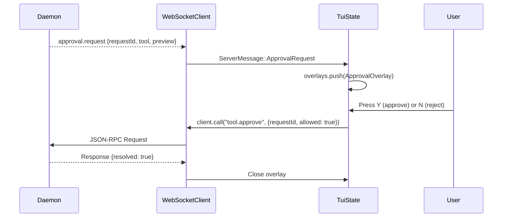

# 06 — TUI Refactor: Decoupling from Core

> Status: Draft ✅ DECIDED  
> Date: 2026-04-20  
> Scope: Removing all `agent_core` imports, building a WebSocket client, reconstructing render state from events

This document defines the concrete refactoring of `agent-tui` from a runtime controller to a pure presentation layer. It is the most invasive change to the TUI codebase.

---

## 1. Current Import Audit

From `../tui-core-interface-audit.md`, the TUI imports 140+ symbols from `agent_core` across 18 files. The top imported modules:

| Module | Refs | Files |
|--------|------|-------|
| `agent_core::app` | 26 | `app_loop.rs`, `ui_state.rs`, `render.rs` |
| `agent_core::agent_runtime` | 12 | `app_loop.rs`, `agent_overview.rs` |
| `agent_core::ProviderKind` | 11 | `app_loop.rs`, `ui_state.rs` |
| `agent_core::shutdown_snapshot` | 9 | `app_loop.rs`, `ui_state.rs` |
| `agent_core::agent_pool` | 8 | `app_loop.rs`, `ui_state.rs` |
| `agent_core::event_aggregator` | 6 | `app_loop.rs` |
| `agent_core::mailbox` | 5 | `app_loop.rs`, `ui_state.rs` |

---

## 2. Target Crate Dependencies

### 2.1 Cargo.toml

**Before**:

```toml
[dependencies]
agent-core = { path = "../core" }
agent-decision = { path = "../decision" }
agent-kanban = { path = "../kanban" }
# ... + ratatui, crossterm, etc.
```

**After**:

```toml
[dependencies]
agent-protocol = { path = "../protocol" }
# agent-types = { path = "../types" }  # May still need for AgentRole, ProviderKind
# NO agent-core, NO agent-decision, NO agent-kanban

ratatui = "0.29"
crossterm = "0.28"
tokio = { version = "1", features = ["full"] }
tokio-tungstenite = "0.24"
futures = "0.3"
serde_json = "1"
# ... other UI deps
```

### 2.2 What Stays, What Goes

| Current Dependency | Action | Reason |
|-------------------|--------|--------|
| `agent-core` | **Remove** | All runtime state moves to daemon |
| `agent-decision` | **Remove** | Decision requests come as notifications |
| `agent-kanban` | **Remove** | Kanban data comes in `SessionState.workplace` |
| `agent-types` | **Keep** | `AgentRole`, `ProviderKind` still used in UI |
| `ratatui` | **Keep** | Rendering library |
| `crossterm` | **Keep** | Input handling |
| `pulldown-cmark` | **Keep** | Markdown rendering (transcript content) |

---

## 3. New Module Structure

```
tui/src/
├── lib.rs                    # Re-exports, version info
├── main.rs                   # Binary entry (if standalone)
├── app_loop.rs               # Main event loop (crossterm + WebSocket events)
├── ui_state.rs               # TuiState: pure render state
├── render.rs                 # ratatui widgets (unchanged logic, new data sources)
├── websocket_client.rs       # NEW: WebSocket connection, JSON-RPC client
├── event_handler.rs          # NEW: Apply agent_protocol::Event to TuiState
├── composer.rs               # Input composer (unchanged)
├── overlays/                 # Modal overlays (unchanged)
├── widgets/                  # Custom ratatui widgets (unchanged)
└── theme.rs                  # Color theme (unchanged)
```

**Removed modules**:
- No more direct imports from `agent_core` anywhere.
- `logging.rs` may move to `agent-daemon` or stay as a thin wrapper.

---

## 4. WebSocket Client Module

### 4.1 Responsibilities

The `websocket_client` module handles:
1. Connect to daemon via auto-link (discover workplace → read daemon.json → connect).
2. Send JSON-RPC Requests and receive Responses.
3. Receive JSON-RPC Notifications (events, approval requests, heartbeats).
4. Maintain connection state (connected / reconnecting / disconnected).
5. Handle reconnection with exponential backoff.

### 4.2 Type Design

```rust
// tui/src/websocket_client.rs

use agent_protocol::jsonrpc::*;
use agent_protocol::methods::*;
use agent_protocol::events::Event;
use futures::{SinkExt, StreamExt};
use tokio::net::TcpStream;
use tokio::sync::{mpsc, oneshot};
use tokio_tungstenite::{connect_async, tungstenite::Message, MaybeTlsStream, WebSocketStream};

pub struct WebSocketClient {
    /// Channel for outgoing requests/notifications.
    request_tx: mpsc::UnboundedSender<ClientMessage>,
    /// Channel for incoming events from daemon.
    event_rx: mpsc::UnboundedReceiver<ServerMessage>,
    /// Connection state for UI display.
    state: ConnectionState,
}

enum ClientMessage {
    Request {
        id: String,
        method: String,
        params: serde_json::Value,
        response_tx: oneshot::Sender<JsonRpcResponse>,
    },
    Notification {
        method: String,
        params: serde_json::Value,
    },
}

enum ServerMessage {
    Event(Event),
    ApprovalRequest(ApprovalRequestParams),
    DecisionRequest(DecisionRequestParams),
    HeartbeatAck,
    Error(String),
    Disconnected,
}

impl WebSocketClient {
    pub async fn connect(daemon_url: &str) -> anyhow::Result<Self> {
        let (ws_stream, _) = connect_async(daemon_url).await?;
        let (mut write, mut read) = ws_stream.split();

        let (request_tx, mut request_rx) = mpsc::unbounded_channel::<ClientMessage>();
        let (event_tx, event_rx) = mpsc::unbounded_channel::<ServerMessage>();

        // Spawn read task
        let event_tx_clone = event_tx.clone();
        tokio::spawn(async move {
            while let Some(Ok(msg)) = read.next().await {
                if let Message::Text(text) = msg {
                    match parse_server_message(&text) {
                        Ok(server_msg) => {
                            let _ = event_tx_clone.send(server_msg);
                        }
                        Err(e) => {
                            let _ = event_tx_clone.send(ServerMessage::Error(e.to_string()));
                        }
                    }
                }
            }
            let _ = event_tx_clone.send(ServerMessage::Disconnected);
        });

        // Spawn write task
        tokio::spawn(async move {
            while let Some(msg) = request_rx.recv().await {
                let json = match msg {
                    ClientMessage::Request { id, method, params, .. } => {
                        serde_json::to_string(&JsonRpcRequest {
                            jsonrpc: "2.0".to_string(),
                            id: RequestId::String(id),
                            method,
                            params: Some(params),
                        })
                    }
                    ClientMessage::Notification { method, params } => {
                        serde_json::to_string(&JsonRpcNotification {
                            jsonrpc: "2.0".to_string(),
                            method,
                            params: Some(params),
                        })
                    }
                };
                if let Ok(json) = json {
                    let _ = write.send(Message::Text(json)).await;
                }
            }
        });

        Ok(Self {
            request_tx,
            event_rx,
            state: ConnectionState::Connected,
        })
    }

    pub async fn call(&self, method: &str, params: serde_json::Value) -> anyhow::Result<JsonRpcResponse> {
        let id = format!("req-{}", uuid::Uuid::new_v4());
        let (response_tx, response_rx) = oneshot::channel();
        self.request_tx.send(ClientMessage::Request {
            id,
            method: method.to_string(),
            params,
            response_tx,
        })?;
        let response = response_rx.await?;
        Ok(response)
    }

    pub async fn notify(&self, method: &str, params: serde_json::Value) -> anyhow::Result<()> {
        self.request_tx.send(ClientMessage::Notification {
            method: method.to_string(),
            params,
        })?;
        Ok(())
    }

    pub fn event_receiver(&mut self) -> &mut mpsc::UnboundedReceiver<ServerMessage> {
        &mut self.event_rx
    }
}
```

### 4.3 Auto-Link Integration

```rust
// tui/src/websocket_client.rs

impl WebSocketClient {
    pub async fn auto_link() -> anyhow::Result<Self> {
        let workplace = WorkplaceStore::for_cwd().await?;
        let daemon_json = workplace.daemon_json_path();

        if daemon_json.exists() {
            let config: DaemonConfig = read_json(&daemon_json).await?;
            if is_daemon_alive(config.pid).await {
                return Self::connect(&config.websocket_url).await;
            }
            // Stale config — remove and spawn new daemon
            tokio::fs::remove_file(&daemon_json).await?;
        }

        // Spawn daemon
        let daemon_url = spawn_daemon(&workplace).await?;
        Self::connect(&daemon_url).await
    }
}
```

---

## 5. Event Handler Module

### 5.1 Responsibilities

The `event_handler` module receives `agent_protocol::Event` values from the WebSocket client and updates `TuiState`. This is the TUI-side counterpart to the daemon's `convert_provider_event()`.

### 5.2 Implementation

```rust
// tui/src/event_handler.rs

use agent_protocol::events::*;
use crate::ui_state::TuiState;

/// Applies a daemon event to the TUI render state.
pub fn apply_event(state: &mut TuiState, event: &Event) {
    match &event.payload {
        EventPayload::AgentSpawned(data) => {
            state.agents.push(data.into());
        }
        EventPayload::AgentStopped(data) => {
            state.agents.retain(|a| a.id != data.agent_id);
            if state.focused_agent_id.as_ref() == Some(&data.agent_id) {
                state.focused_agent_id = None;
            }
        }
        EventPayload::AgentStatusChanged(data) => {
            if let Some(agent) = state.agents.iter_mut().find(|a| a.id == data.agent_id) {
                agent.status = data.status;
            }
        }
        EventPayload::ItemStarted(data) => {
            state.transcript.push(TranscriptItem {
                id: data.item_id.clone(),
                kind: data.kind,
                agent_id: Some(data.agent_id.clone()),
                content: String::new(),
                metadata: serde_json::Value::Null,
                created_at: chrono::Utc::now().to_rfc3339(),
                completed_at: None,
            });
        }
        EventPayload::ItemDelta(data) => {
            if let Some(item) = state.transcript.iter_mut().find(|i| i.id == data.item_id) {
                match &data.delta {
                    ItemDelta::Text(text) => item.content.push_str(text),
                    ItemDelta::Markdown(text) => item.content.push_str(text), // TUI renders as markdown
                }
            }
        }
        EventPayload::ItemCompleted(data) => {
            if let Some(item) = state.transcript.iter_mut().find(|i| i.id == data.item_id) {
                *item = data.item.clone();
            }
        }
        EventPayload::MailReceived(data) => {
            state.mail_notifications.push(data.clone());
        }
        EventPayload::Error(data) => {
            state.status_line = format!("Error: {}", data.message);
        }
    }
}
```

---

## 6. App Loop Refactor

### 6.1 Current Flow

```rust
// Current app_loop.rs (simplified)
loop {
    // 1. Poll crossterm events
    if let Some(key) = read_crossterm_event()? { /* ... */ }

    // 2. Poll provider events (direct mpsc from core)
    while let Ok(event) = state.event_aggregator.try_recv() {
        handle_provider_event(&mut state, event);
    }

    // 3. Direct method calls on core objects
    if should_spawn {
        state.agent_pool.as_mut().unwrap().spawn(...);
    }

    // 4. Render
    terminal.draw(|f| render(&state, f))?;
}
```

### 6.2 Target Flow

```rust
// Target app_loop.rs (simplified)
loop {
    tokio::select! {
        // 1. Crossterm input events
        Some(key) = crossterm_rx.recv() => {
            handle_input(&mut state, key, &client).await?;
        }

        // 2. WebSocket events from daemon
        Some(msg) = client.event_receiver().recv() => {
            match msg {
                ServerMessage::Event(event) => {
                    apply_event(&mut state, &event);
                }
                ServerMessage::ApprovalRequest(req) => {
                    state.overlays.push(Overlay::Approval(req));
                }
                ServerMessage::Disconnected => {
                    state.connection = ConnectionState::Reconnecting;
                    // Trigger reconnect logic
                }
                // ...
            }
        }

        // 3. Render tick (60fps)
        _ = render_interval.tick() => {
            terminal.draw(|f| render(&state, f))?;
        }
    }
}
```

### 6.3 Input Handling

```rust
async fn handle_input(
    state: &mut TuiState,
    key: KeyEvent,
    client: &WebSocketClient,
) -> anyhow::Result<()> {
    match key.code {
        KeyCode::Enter => {
            let text = state.composer.take_text();
            client.call("session.sendInput", json!({"text": text})).await?;
        }
        KeyCode::Char('s') if key.modifiers == KeyModifiers::CONTROL => {
            client.call("agent.spawn", json!({"provider":"claude","role":"Developer"})).await?;
        }
        KeyCode::Char('q') if key.modifiers == KeyModifiers::CONTROL => {
            if let Some(agent_id) = state.focused_agent_id.clone() {
                client.call("agent.stop", json!({"agentId": agent_id})).await?;
            }
        }
        // ... other keybindings
    }
    Ok(())
}
```

---

## 7. Per-File Migration Plan

| File | Changes |
|------|---------|
| `lib.rs` | Remove `agent_core` re-exports. Export `TuiShutdownSnapshot` from protocol. |
| `app_loop.rs` | Replace `mpsc` polling with `tokio::select!` (WebSocket + crossterm). Replace direct core calls with `client.call()`. |
| `ui_state.rs` | Remove `RuntimeSession`, `AgentPool`, `EventAggregator`, `Mailbox`. Add `connection`, `session`, `agents`. |
| `render.rs` | Change data sources from `agent_core` types to `agent_protocol` types. `TranscriptEntry` → `TranscriptItem`. |
| `agent_overview.rs` | Use `AgentSnapshot` instead of `AgentSlot`. |
| `logging.rs` | Keep or move to daemon. TUI only needs display logging. |
| `websocket_client.rs` | **New file**. WebSocket connection, JSON-RPC framing, auto-link. |
| `event_handler.rs` | **New file**. `apply_event()` function. |

---

## 8. Approval Overlay Flow

When the daemon sends an `approval.request` notification:



The overlay state (open/closed, selected option) is purely local to the TUI. The daemon only knows that an approval request was sent and eventually resolved.

---

## 9. Anti-Patterns to Avoid

| Anti-Pattern | Why It's Bad | What We Do Instead |
|--------------|-------------|-------------------|
| Blocking the render loop on WebSocket I/O | UI freezes during slow requests | Use `tokio::select!` with async I/O |
| Caching daemon state locally beyond render needs | Stale data, sync bugs | Reconstruct everything from events; only cache what's needed for the current frame |
| Sending `agent_core` types over the wire | Couples protocol to internal types | Use `agent_protocol` types exclusively |
| Holding `Mutex` across `await` in event handler | Blocks async runtime | Use `&mut TuiState` (single-threaded access in app loop) |
| Ignoring WebSocket disconnect | Silent failures, zombie UI | Explicit `Disconnected` event → show reconnect banner |
