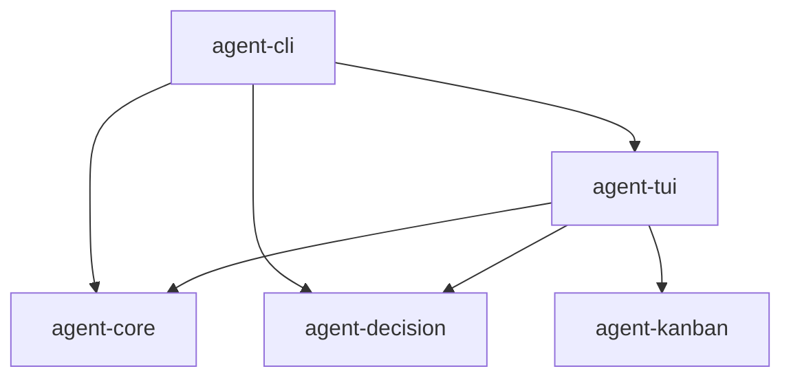
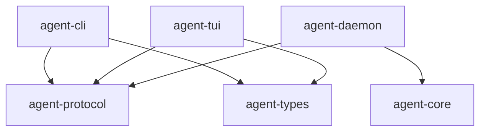

# 07 — CLI Refactor: Peer Client Architecture

> Status: Draft ✅ DECIDED  
> Date: 2026-04-20  
> Scope: Removing TUI library dependency, implementing standalone protocol client, daemon lifecycle commands

This document defines the refactoring of `agent-cli` from a TUI-dependent binary to an independent peer client that speaks `agent-protocol` over WebSocket.

---

## 1. Current State

### 1.1 Dependency Graph (Current)



`agent-cli` depends on `agent-tui` as a library. The CLI's `main()` calls `agent_cli::app_runner::run()`, which either:
- Launches the TUI (`agent_tui::run_tui()`) for interactive mode.
- Runs headless logic using `agent_core` directly for `RunLoop`, `Probe`, etc.

### 1.2 The Problem

- The CLI cannot be built without the TUI crate.
- Headless commands (`agent-cli doctor`, `agent-cli agent list`) still pull in ratatui, crossterm, and all TUI dependencies.
- The CLI duplicates core logic that should live in the daemon.

---

## 2. Target Architecture

### 2.1 Dependency Graph (Target)



`agent-cli` depends only on `agent-protocol` and `agent-types`. It has **zero** knowledge of `agent-core`, `agent-tui`, `agent-decision`, or `agent-kanban`.

### 2.2 Cargo.toml

**Before**:

```toml
[dependencies]
agent-core = { path = "../core" }
agent-decision = { path = "../decision" }
agent-tui = { path = "../tui" }
clap = { version = "4", features = ["derive"] }
anyhow = "1"
serde_json = "1"
```

**After**:

```toml
[dependencies]
agent-protocol = { path = "../protocol" }
agent-types = { path = "../types" }
clap = { version = "4", features = ["derive"] }
anyhow = "1"
tokio = { version = "1", features = ["full"] }
tokio-tungstenite = "0.24"
serde_json = "1"
```

---

## 3. CLI Command Restructuring

### 3.1 Current Commands

```
agile-agent doctor              # Probe providers
agile-agent agent current       # Show current agent
agile-agent agent list          # List agents
agile-agent agent spawn <provider>  # Spawn agent
agile-agent agent stop <id>     # Stop agent
agile-agent agent status <id>   # Agent status
agile-agent workplace current   # Show workplace
agile-agent decision list       # List decisions
agile-agent decision show <id>  # Show decision
agile-agent decision respond <id>  # Respond to decision
agile-agent resume-last         # Resume last session
agile-agent run-loop            # Headless autonomous loop
agile-agent probe               # Provider probe
```

### 3.2 Target Commands

**Daemon lifecycle** (new):

```
agile-agent daemon start        # Start daemon for current workplace
agile-agent daemon stop         # Stop daemon for current workplace
agile-agent daemon status       # Show daemon status (pid, port, uptime)
agile-agent daemon logs         # Tail daemon logs
```

**Session commands** (modified):

```
agile-agent session             # Enter TUI (connects to daemon)
agile-agent session status      # Show session state as JSON
agile-agent session history     # Show transcript as JSON or plain text
```

**Agent commands** (modified — all go through daemon):

```
agile-agent agent list          # List agents (JSON or table)
agile-agent agent spawn <provider>  # Spawn agent
agile-agent agent stop <id>     # Stop agent
agile-agent agent status <id>   # Agent status
```

**Task commands** (new — replaces `run-loop`):

```
agile-agent run --prompt "..."  # Send input, wait for completion, print result
agile-agent run --file task.md  # Send file content as input
```

**Utility commands** (unchanged):

```
agile-agent doctor              # Probe providers (local, no daemon needed)
agile-agent probe               # Structured probe results
```

### 3.3 Command Routing

```rust
// cli/src/main.rs (target)

#[tokio::main]
async fn main() -> anyhow::Result<()> {
    let cli = Cli::parse();

    match cli.command {
        // Daemon lifecycle — may spawn/kill daemon directly
        Command::Daemon { command } => handle_daemon_command(command).await?,

        // Doctor / probe — local only, no daemon needed
        Command::Doctor => handle_doctor().await?,
        Command::Probe { json } => handle_probe(json).await?,

        // Everything else — connect to daemon via protocol
        command => {
            let client = connect_to_daemon().await?;
            handle_remote_command(client, command).await?;
        }
    }

    Ok(())
}
```

---

## 4. Protocol Client Implementation

### 4.1 Shared Client Abstraction

The CLI needs a simpler client than the TUI because:
- CLI is mostly request/response (not event-driven).
- CLI does not need real-time event streaming (except for `run --prompt`).
- CLI may run in blocking mode (simpler than TUI's async event loop).

```rust
// cli/src/protocol_client.rs

use agent_protocol::jsonrpc::*;
use agent_protocol::methods::*;
use agent_protocol::events::Event;
use futures::{SinkExt, StreamExt};
use tokio::net::TcpStream;
use tokio::sync::{mpsc, oneshot};
use tokio_tungstenite::{connect_async, tungstenite::Message};

/// Blocking-friendly protocol client for CLI operations.
pub struct ProtocolClient {
    request_tx: mpsc::UnboundedSender<OutgoingMessage>,
    event_rx: Option<mpsc::UnboundedReceiver<Event>>,
}

enum OutgoingMessage {
    Request {
        id: String,
        method: String,
        params: serde_json::Value,
        response_tx: oneshot::Sender<JsonRpcResponse>,
    },
    Notification {
        method: String,
        params: serde_json::Value,
    },
    SubscribeEvents,
    UnsubscribeEvents,
}

impl ProtocolClient {
    pub async fn connect(daemon_url: &str) -> anyhow::Result<Self> {
        // Similar to TUI's WebSocketClient but simpler
        // (omitted for brevity — same pattern as IMP-06 §4)
        todo!()
    }

    /// Send a request and await the response.
    pub async fn request(&self, method: &str, params: serde_json::Value) -> anyhow::Result<JsonRpcResponse> {
        let id = format!("cli-{}", uuid::Uuid::new_v4());
        let (tx, rx) = oneshot::channel();
        self.request_tx.send(OutgoingMessage::Request {
            id, method: method.to_string(), params, response_tx: tx,
        })?;
        let response = rx.await?;
        Ok(response)
    }

    /// Send a notification (fire-and-forget).
    pub fn notify(&self, method: &str, params: serde_json::Value) -> anyhow::Result<()> {
        self.request_tx.send(OutgoingMessage::Notification {
            method: method.to_string(), params,
        })?;
        Ok(())
    }

    /// Start receiving event notifications.
    pub fn subscribe_events(&mut self) -> anyhow::Result<mpsc::UnboundedReceiver<Event>> {
        self.request_tx.send(OutgoingMessage::SubscribeEvents)?;
        let (tx, rx) = mpsc::unbounded_channel();
        self.event_rx = Some(rx);
        Ok(rx)
    }
}
```

### 4.2 Auto-Link (Shared with TUI)

The auto-link logic (discover workplace, read `daemon.json`, spawn if needed) is **identical** for CLI and TUI. Extract it into a shared module:

```rust
// agent-protocol/src/client/auto_link.rs (or a new `agent-client-utils` crate)

use std::path::PathBuf;

pub struct DaemonConnection {
    pub websocket_url: String,
    pub workplace_id: String,
}

/// Discovers or spawns the daemon for the current working directory.
pub async fn auto_link() -> anyhow::Result<DaemonConnection> {
    let workplace = WorkplaceStore::for_cwd().await?;
    let daemon_json = workplace.daemon_json_path();

    if daemon_json.exists() {
        let config: DaemonConfig = read_json(&daemon_json).await?;
        if is_process_alive(config.pid).await {
            return Ok(DaemonConnection {
                websocket_url: config.websocket_url,
                workplace_id: workplace.id,
            });
        }
        // Stale config
        tokio::fs::remove_file(&daemon_json).await?;
    }

    // Spawn daemon
    let daemon = spawn_daemon(&workplace).await?;
    Ok(DaemonConnection {
        websocket_url: daemon.websocket_url,
        workplace_id: workplace.id,
    })
}

async fn spawn_daemon(workplace: &Workplace) -> anyhow::Result<DaemonConfig> {
    let daemon_bin = find_daemon_binary()?;
    let mut child = tokio::process::Command::new(daemon_bin)
        .arg("--workplace-id").arg(&workplace.id)
        .arg("--alias").arg(&workplace.alias)
        .stdout(std::process::Stdio::piped())
        .stderr(std::process::Stdio::piped())
        .spawn()?;

    // Wait for daemon.json to appear (with timeout)
    let config = wait_for_daemon_json(&workplace.daemon_json_path(), 10).await?;
    Ok(config)
}
```

**Design decision**: Put auto-link in `agent-protocol/src/client/` as an optional module. Both CLI and TUI can use it without adding a new crate.

---

## 5. Command Implementations

### 5.1 `agile-agent daemon start`

```rust
async fn handle_daemon_start() -> anyhow::Result<()> {
    let connection = auto_link().await?;
    println!("Daemon running at {}", connection.websocket_url);
    Ok(())
}
```

If the daemon is already running, this is a no-op (auto-link returns the existing connection).

### 5.2 `agile-agent daemon stop`

```rust
async fn handle_daemon_stop() -> anyhow::Result<()> {
    let workplace = WorkplaceStore::for_cwd().await?;
    let daemon_json = workplace.daemon_json_path();

    if !daemon_json.exists() {
        println!("No daemon running for this workplace.");
        return Ok(());
    }

    let config: DaemonConfig = read_json(&daemon_json).await?;

    // Send graceful shutdown via protocol
    let client = ProtocolClient::connect(&config.websocket_url).await?;
    client.notify("session.shutdown", json!({})).await?;

    // Wait for daemon.json to disappear
    wait_for_file_removal(&daemon_json, 5).await?;
    println!("Daemon stopped.");
    Ok(())
}
```

### 5.3 `agile-agent agent list`

```rust
async fn handle_agent_list(include_stopped: bool) -> anyhow::Result<()> {
    let client = connect_to_daemon().await?;
    let response = client.request("agent.list", json!({"includeStopped": include_stopped})).await?;

    let result: AgentListResult = serde_json::from_value(response.result.unwrap())?;

    // Print as table
    println!("{:<20} {:<15} {:<12} {:<10}", "ID", "Codename", "Role", "Status");
    for agent in result.agents {
        println!("{:<20} {:<15} {:<12} {:<10}",
            agent.id, agent.codename, agent.role, format!("{:?}", agent.status));
    }
    Ok(())
}
```

### 5.4 `agile-agent run --prompt "..."`

This is the headless execution mode. It sends input and waits for the agent to finish:

```rust
async fn handle_run(prompt: &str) -> anyhow::Result<()> {
    let mut client = connect_to_daemon().await?;

    // Initialize session
    client.request("session.initialize", json!({"clientType":"cli"})).await?;

    // Send input
    client.request("session.sendInput", json!({"text": prompt})).await?;

    // Subscribe to events and wait for completion
    let mut event_rx = client.subscribe_events()?;

    let mut output = String::new();
    while let Some(event) = event_rx.recv().await {
        match event.payload {
            EventPayload::ItemDelta(data) => {
                if let ItemDelta::Text(text) = data.delta {
                    output.push_str(&text);
                    print!("{}", text);
                    std::io::stdout().flush()?;
                }
            }
            EventPayload::ItemCompleted(_) => {
                println!();
                break;
            }
            EventPayload::ApprovalRequest(data) => {
                // In headless mode, auto-reject or prompt user
                eprintln!("Approval required: {} - {}", data.tool, data.preview);
                eprint!("Approve? [y/N] ");
                let mut input = String::new();
                std::io::stdin().read_line(&mut input)?;
                let allowed = input.trim().eq_ignore_ascii_case("y");
                client.request("tool.approve", json!({"requestId": data.request_id, "allowed": allowed})).await?;
            }
            _ => {}
        }
    }

    Ok(())
}
```

### 5.5 `agile-agent session`

This enters the TUI. The CLI spawns the TUI binary or calls into it:

```rust
async fn handle_session() -> anyhow::Result<()> {
    // Option A: Spawn TUI as separate binary
    let tui_bin = find_tui_binary()?;
    let status = tokio::process::Command::new(tui_bin)
        .status()
        .await?;

    // Option B: Call into agent-tui library (requires agent-tui dep)
    // agent_tui::run_tui().await?;

    Ok(())
}
```

**Decision**: Option A (spawn subprocess) is preferred because it avoids re-adding the `agent-tui` dependency. The TUI binary handles its own auto-link. The CLI simply ensures the daemon is running and then hands over to the TUI.

---

## 6. `agent-cli doctor` — The Exception

`doctor` and `probe` are **local-only** commands that inspect the environment without a daemon:

```rust
async fn handle_doctor() -> anyhow::Result<()> {
    // Directly use agent-provider to probe available providers
    let providers = agent_provider::probe_all().await?;

    println!("Provider Status:");
    for provider in providers {
        println!("  {}: {}", provider.name, if provider.available { "✓" } else { "✗" });
    }
    Ok(())
}
```

This requires `agent-provider` as a dependency. This is acceptable because:
- `agent-provider` is an infrastructure crate (no core logic).
- Probing is a pure side-effect-free operation.
- It avoids requiring a running daemon for a simple diagnostic command.

If we want to keep CLI strictly protocol-only, `doctor` could query the daemon instead. But that adds friction (must start daemon to run diagnostics). **Keep `agent-provider` in CLI for `doctor` and `probe` only.**

---

## 7. Migration Steps

### Step 1: Add `agent-protocol` dependency

Add `agent-protocol` to `cli/Cargo.toml`. Do not remove `agent-tui` yet.

### Step 2: Implement `ProtocolClient`

Create `cli/src/protocol_client.rs` with WebSocket connection and JSON-RPC request/response handling.

### Step 3: Implement daemon lifecycle commands

Add `daemon start/stop/status` commands that use `ProtocolClient`.

### Step 4: Migrate `agent` subcommands

Rewrite `agent list`, `agent spawn`, `agent stop`, `agent status` to use `ProtocolClient` instead of direct `agent_core` calls.

### Step 5: Migrate `session` subcommands

Rewrite `resume-last` and add `session` (TUI launcher).

### Step 6: Migrate `run-loop` to `run --prompt`

Replace the headless loop with the event-driven `run` command.

### Step 7: Remove `agent-tui` and `agent-core` dependencies

Once all commands use `ProtocolClient`, remove `agent-tui` and `agent-core` from `cli/Cargo.toml`.

### Step 8: Clean up

Remove dead code, unused imports, and legacy handler functions.

---

## 8. Anti-Patterns to Avoid

| Anti-Pattern | Why It's Bad | What We Do Instead |
|--------------|-------------|-------------------|
| Keeping `agent-core` for "just one command" | Creates hidden coupling, prevents full separation | Move that command's logic to daemon or use `agent-provider` directly |
| Re-adding `agent-tui` as a dependency for TUI mode | Defeats the purpose of separation | Spawn TUI as subprocess |
| Blocking `main()` on WebSocket operations | Prevents SIGINT handling, poor UX | Use `tokio::main` and async throughout |
| String-based method dispatch | Typos are runtime errors | Use typed methods from `agent-protocol` |
| Ignoring daemon.json staleness | Connects to dead daemon, confusing errors | Always check PID liveness before connecting |
