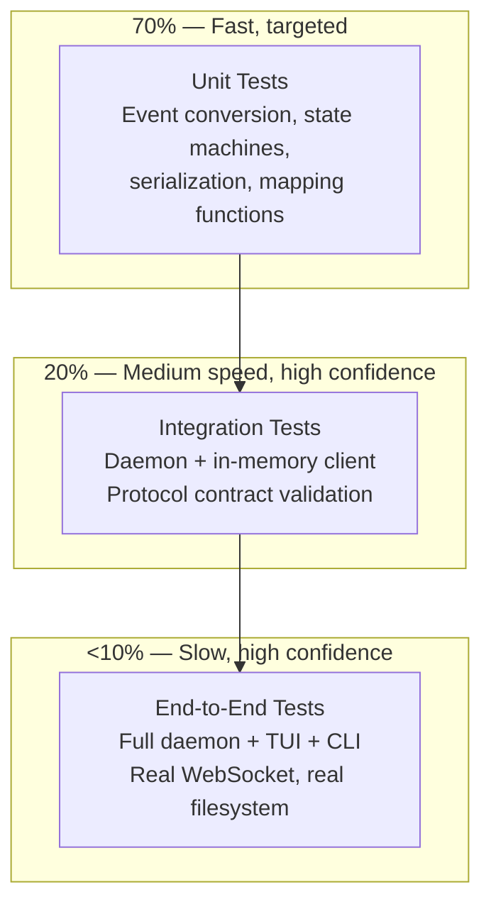

# 08 — Testing Strategy

> Status: Draft ✅ DECIDED  
> Date: 2026-04-20  
> Scope: Unit tests, integration tests, contract tests, test harnesses for daemon and clients

This document defines the testing approach for the TUI-backend separation. The architecture creates new testing challenges (need a daemon for client tests) but also new opportunities (protocol contract tests).

---

## 1. Testing Pyramid



---

## 2. Unit Tests

### 2.1 Event Conversion (daemon)

```rust
// agent/daemon/src/event_pump.rs

#[cfg(test)]
mod tests {
    use super::*;
    use agent_core::event_aggregator::ProviderEvent;
    use agent_protocol::events::*;

    #[test]
    fn convert_exec_command_started() {
        let pe = ProviderEvent::ExecCommandStarted {
            agent_id: "a1".into(),
            cmd: "git status".into(),
        };
        let mut state = EventPumpState::new();
        let events = state.process(pe);

        assert_eq!(events.len(), 1);
        assert_eq!(events[0].seq, 1);
        match &events[0].payload {
            EventPayload::ItemStarted(data) => {
                assert_eq!(data.kind, ItemKind::ToolCall);
                assert_eq!(data.agent_id, "a1");
            }
            _ => panic!("Expected ItemStarted"),
        }
    }

    #[test]
    fn convert_output_delta_appends_to_current_item() {
        let mut state = EventPumpState::new();
        state.current_items.insert("a1".into(), "item-1".into());

        let pe = ProviderEvent::OutputDelta {
            agent_id: "a1".into(),
            content: "Hello".into(),
        };
        let events = state.process(pe);

        match &events[0].payload {
            EventPayload::ItemDelta(data) => {
                assert_eq!(data.item_id, "item-1");
                assert_eq!(data.delta.text, "Hello");
            }
            _ => panic!("Expected ItemDelta"),
        }
    }

    #[test]
    fn sequence_numbers_are_monotonic() {
        let mut state = EventPumpState::new();
        let e1 = state.mk_event(EventPayload::AgentSpawned(AgentSpawnedData {
            agent_id: "a1".into(), codename: "test".into(), role: "Developer".into(),
        }));
        let e2 = state.mk_event(EventPayload::AgentSpawned(AgentSpawnedData {
            agent_id: "a2".into(), codename: "test2".into(), role: "Developer".into(),
        }));
        assert_eq!(e1.seq + 1, e2.seq);
    }
}
```

### 2.2 State Mapping (daemon)

```rust
// agent/daemon/src/session_mgr.rs

#[cfg(test)]
mod tests {
    use super::*;
    use agent_core::agent_slot::{AgentSlot, AgentSlotStatus};
    use agent_types::AgentRole;

    #[test]
    fn map_agent_snapshot() {
        let slot = AgentSlot {
            id: "agent-1".into(),
            codename: "claude-dev".into(),
            role: AgentRole::Developer,
            status: AgentSlotStatus::Running,
            // ... other fields
        };
        let snapshot = into_agent_snapshot(&slot);
        assert_eq!(snapshot.id, "agent-1");
        assert_eq!(snapshot.codename, "claude-dev");
        assert_eq!(snapshot.status, AgentSnapshotStatus::Running);
    }
}
```

### 2.3 Event Application (TUI)

```rust
// tui/src/event_handler.rs

#[cfg(test)]
mod tests {
    use super::*;
    use agent_protocol::events::*;

    #[test]
    fn apply_agent_spawned_adds_agent() {
        let mut state = TuiState::default();
        let event = Event {
            seq: 1,
            payload: EventPayload::AgentSpawned(AgentSpawnedData {
                agent_id: "a1".into(),
                codename: "dev".into(),
                role: "Developer".into(),
            }),
        };
        apply_event(&mut state, &event);
        assert_eq!(state.agents.len(), 1);
        assert_eq!(state.agents[0].id, "a1");
    }

    #[test]
    fn apply_agent_stopped_removes_focus() {
        let mut state = TuiState::default();
        state.focused_agent_id = Some("a1".into());
        let event = Event {
            seq: 1,
            payload: EventPayload::AgentStopped(AgentStoppedData {
                agent_id: "a1".into(),
                reason: None,
            }),
        };
        apply_event(&mut state, &event);
        assert!(state.focused_agent_id.is_none());
    }
}
```

### 2.4 Serialization Round-Trip (protocol)

```rust
// agent/protocol/src/jsonrpc.rs

#[cfg(test)]
mod tests {
    use super::*;

    #[test]
    fn request_round_trip() {
        let req = JsonRpcRequest {
            jsonrpc: "2.0".into(),
            id: RequestId::String("req-1".into()),
            method: "session.initialize".into(),
            params: Some(serde_json::json!({"clientType":"tui"})),
        };
        let json = serde_json::to_string(&req).unwrap();
        let parsed: JsonRpcRequest = serde_json::from_str(&json).unwrap();
        assert_eq!(parsed.id, RequestId::String("req-1".into()));
    }

    #[test]
    fn event_serialization_matches_spec() {
        let event = Event {
            seq: 42,
            payload: EventPayload::AgentSpawned(AgentSpawnedData {
                agent_id: "a1".into(),
                codename: "dev".into(),
                role: "Developer".into(),
            }),
        };
        let json = serde_json::to_value(&event).unwrap();
        assert_eq!(json["seq"], 42);
        assert_eq!(json["type"], "agentSpawned");
        assert_eq!(json["data"]["agentId"], "a1");
    }
}
```

---

## 3. Integration Tests

### 3.1 In-Memory WebSocket Harness

The key integration testing primitive is an in-memory WebSocket pair:

```rust
// test-support/src/websocket_harness.rs

use tokio::io::{duplex, DuplexStream};
use tokio_tungstenite::{WebSocketStream, MaybeTlsStream};
use futures::stream::Stream;

/// Creates a connected pair of WebSocket streams.
/// One end is used by the daemon, the other by a test client.
pub async fn create_websocket_pair() -> (
    WebSocketStream<MaybeTlsStream<DuplexStream>>,
    WebSocketStream<MaybeTlsStream<DuplexStream>>,
) {
    let (client_io, server_io) = duplex(4096);

    let client_ws = tokio_tungstenite::WebSocketStream::from_raw_socket(
        MaybeTlsStream::Plain(client_io),
        tokio_tungstenite::tungstenite::protocol::Role::Client,
        None,
    ).await;

    let server_ws = tokio_tungstenite::WebSocketStream::from_raw_socket(
        MaybeTlsStream::Plain(server_io),
        tokio_tungstenite::tungstenite::protocol::Role::Server,
        None,
    ).await;

    (client_ws, server_ws)
}
```

### 3.2 Daemon Test Harness

```rust
// agent/daemon/tests/harness.rs

use agent_daemon::{SessionManager, EventBroadcaster, Router, Connection};
use agent_protocol::jsonrpc::*;
use agent_protocol::methods::*;

pub struct TestDaemon {
    pub session_mgr: Arc<SessionManager>,
    pub broadcaster: BroadcasterHandle,
    pub router: RouterHandle,
}

impl TestDaemon {
    pub async fn new() -> anyhow::Result<Self> {
        let workplace = create_test_workplace().await?;
        let session_mgr = Arc::new(SessionManager::bootstrap(workplace).await?);
        let broadcaster = EventBroadcaster::new();
        let router = Router::new(session_mgr.clone(), broadcaster.clone());

        Ok(Self { session_mgr, broadcaster, router })
    }

    pub async fn connect_client(&self) -> anyhow::Result<TestClient> {
        let (daemon_ws, client_ws) = create_websocket_pair().await;
        Connection::spawn(daemon_ws, self.router.clone(), self.broadcaster.clone());
        Ok(TestClient::new(client_ws))
    }
}

pub struct TestClient {
    ws: WebSocketStream<MaybeTlsStream<DuplexStream>>,
}

impl TestClient {
    pub async fn send_request(&mut self, method: &str, params: serde_json::Value) -> JsonRpcResponse {
        let req = JsonRpcRequest {
            jsonrpc: "2.0".into(),
            id: RequestId::String(format!("req-{}", uuid::Uuid::new_v4())),
            method: method.into(),
            params: Some(params),
        };
        let json = serde_json::to_string(&req).unwrap();
        self.ws.send(Message::Text(json)).await.unwrap();

        // Wait for response
        let msg = self.ws.next().await.unwrap().unwrap();
        match msg {
            Message::Text(text) => {
                let msg: JsonRpcMessage = serde_json::from_str(&text).unwrap();
                match msg {
                    JsonRpcMessage::Response(resp) => resp,
                    JsonRpcMessage::Error(err) => panic!("Error response: {:?}", err),
                    _ => panic!("Unexpected message type"),
                }
            }
            _ => panic!("Unexpected message format"),
        }
    }

    pub async fn recv_notification(&mut self) -> JsonRpcNotification {
        let msg = self.ws.next().await.unwrap().unwrap();
        match msg {
            Message::Text(text) => {
                let msg: JsonRpcMessage = serde_json::from_str(&text).unwrap();
                match msg {
                    JsonRpcMessage::Notification(notif) => notif,
                    _ => panic!("Expected notification, got {:?}", msg),
                }
            }
            _ => panic!("Unexpected message format"),
        }
    }
}
```

### 3.3 Integration Test Example: Spawn Agent

```rust
// agent/daemon/tests/spawn_agent.rs

#[tokio::test]
async fn test_spawn_agent_broadcasts_event() {
    let daemon = TestDaemon::new().await.unwrap();
    let mut client = daemon.connect_client().await.unwrap();

    // Initialize
    let resp = client.send_request("session.initialize", json!({"clientType":"test"})).await;
    assert!(resp.result.is_some());

    // Spawn agent
    let resp = client.send_request("agent.spawn", json!({"provider":"claude","role":"Developer"})).await;
    assert!(resp.result.is_some());

    // Should receive agentSpawned event
    let notif = client.recv_notification().await;
    assert_eq!(notif.method, "event");
    let event: Event = serde_json::from_value(notif.params.unwrap()).unwrap();
    match event.payload {
        EventPayload::AgentSpawned(data) => {
            assert_eq!(data.role, "Developer");
        }
        _ => panic!("Expected AgentSpawned, got {:?}", event.payload),
    }
}
```

### 3.4 Integration Test Example: Gap Recovery

```rust
// agent/daemon/tests/gap_recovery.rs

#[tokio::test]
async fn test_reconnect_receives_missed_events() {
    let daemon = TestDaemon::new().await.unwrap();

    // Client 1 connects and spawns an agent
    let mut client1 = daemon.connect_client().await.unwrap();
    client1.send_request("session.initialize", json!({})).await;
    client1.send_request("agent.spawn", json!({"provider":"claude","role":"Developer"})).await;

    // Client 2 connects late
    let mut client2 = daemon.connect_client().await.unwrap();
    let resp = client2.send_request("session.initialize", json!({})).await;
    let snapshot: SessionState = serde_json::from_value(resp.result.unwrap()).unwrap();

    // Client 2's snapshot should include the spawned agent
    assert_eq!(snapshot.agents.len(), 1);
}
```

---

## 4. Contract Tests

Contract tests verify that the protocol schema is consistent between daemon and clients:

```rust
// agent/protocol/tests/contract.rs

/// Every ClientMethod must round-trip through JSON-RPC envelope.
#[test]
fn all_methods_round_trip() {
    let methods = vec![
        ClientMethod::SessionInitialize(InitializeParams {
            client_type: ClientType::Tui,
            client_version: "1.0.0".into(),
            resume_snapshot_id: None,
            protocol_version: None,
        }),
        ClientMethod::AgentSpawn(AgentSpawnParams {
            provider: ProviderKind::Claude,
            role: AgentRole::Developer,
            codename: Some("test".into()),
        }),
        // ... all variants
    ];

    for method in methods {
        let (name, params) = method_name_and_params(&method);
        let req = JsonRpcRequest {
            jsonrpc: "2.0".into(),
            id: RequestId::String("test".into()),
            method: name.into(),
            params: Some(params),
        };
        let json = serde_json::to_string(&req).unwrap();
        let parsed: JsonRpcRequest = serde_json::from_str(&json).unwrap();
        assert_eq!(parsed.method, name);
    }
}

/// Every Event variant must serialize to the expected wire format.
#[test]
fn all_events_match_wire_spec() {
    let events = vec![
        Event { seq: 1, payload: EventPayload::AgentSpawned(AgentSpawnedData { agent_id: "a1".into(), codename: "dev".into(), role: "Developer".into() }) },
        Event { seq: 2, payload: EventPayload::ItemStarted(ItemStartedData { item_id: "i1".into(), kind: ItemKind::ToolCall, agent_id: "a1".into() }) },
        // ... all variants
    ];

    for event in events {
        let json = serde_json::to_value(&event).unwrap();
        assert!(json.get("seq").is_some());
        assert!(json.get("type").is_some());
        assert!(json.get("data").is_some());
    }
}
```

---

## 5. End-to-End Tests

### 5.1 E2E Test Harness

E2E tests spawn real processes:

```rust
// cli/tests/e2e.rs

use std::process::Stdio;
use tokio::process::Command;

struct E2EContext {
    daemon: tokio::process::Child,
    workplace_dir: tempfile::TempDir,
}

impl E2EContext {
    async fn new() -> anyhow::Result<Self> {
        let workplace_dir = tempfile::tempdir()?;
        let daemon_bin = env!("CARGO_BIN_EXE_agent-daemon");

        let daemon = Command::new(daemon_bin)
            .arg("--workplace-id").arg("test-wp")
            .current_dir(&workplace_dir)
            .stdout(Stdio::piped())
            .stderr(Stdio::piped())
            .spawn()?;

        // Wait for daemon.json
        let daemon_json = workplace_dir.path().join(".agile-agent/daemon.json");
        tokio::time::timeout(Duration::from_secs(10), async {
            while !daemon_json.exists() {
                tokio::time::sleep(Duration::from_millis(100)).await;
            }
        }).await?;

        Ok(Self { daemon, workplace_dir })
    }

    async fn cli(&self, args: &[&str]) -> anyhow::Result<String> {
        let cli_bin = env!("CARGO_BIN_EXE_agent-cli");
        let output = Command::new(cli_bin)
            .args(args)
            .current_dir(&self.workplace_dir)
            .output()
            .await?;
        Ok(String::from_utf8(output.stdout)?)
    }
}

#[tokio::test]
async fn e2e_daemon_start_stop() {
    let ctx = E2EContext::new().await.unwrap();

    // Start daemon (should be idempotent — already running)
    let out = ctx.cli(&["daemon", "status"]).await.unwrap();
    assert!(out.contains("running"));

    // List agents
    let out = ctx.cli(&["agent", "list"]).await.unwrap();
    // Should be empty initially

    ctx.daemon.kill().await.ok();
}
```

---

## 6. Performance Tests

### 6.1 Event Throughput

```rust
#[tokio::test]
async fn event_throughput_1000_events() {
    let daemon = TestDaemon::new().await.unwrap();
    let mut client = daemon.connect_client().await.unwrap();
    client.send_request("session.initialize", json!({})).await;

    let start = Instant::now();
    for i in 0..1000 {
        daemon.broadcaster.broadcast(Event {
            seq: i,
            payload: EventPayload::ItemDelta(ItemDeltaData {
                item_id: "item-1".into(),
                delta: ItemDelta::Text("x".into()),
            }),
        });
    }

    // Receive all events
    for i in 0..1000 {
        let notif = client.recv_notification().await;
        let event: Event = serde_json::from_value(notif.params.unwrap()).unwrap();
        assert_eq!(event.seq, i);
    }

    let elapsed = start.elapsed();
    println!("1000 events in {:?} ({} events/sec)", elapsed, 1000.0 / elapsed.as_secs_f64());
    assert!(elapsed < Duration::from_secs(1)); // Should be much faster than 1s on localhost
}
```

### 6.2 Snapshot Size Benchmark

```rust
#[test]
fn snapshot_size_with_large_transcript() {
    let mut state = SessionState::default();
    for i in 0..10_000 {
        state.app_state.transcript.push(TranscriptItem {
            id: format!("item-{}", i),
            kind: ItemKind::AssistantOutput,
            agent_id: Some("a1".into()),
            content: "Lorem ipsum dolor sit amet.".repeat(100),
            // ...
        });
    }

    let json = serde_json::to_string(&state).unwrap();
    println!("Snapshot size: {} KB", json.len() / 1024);
    // Assert it's under some reasonable limit (e.g., 10MB)
    assert!(json.len() < 10 * 1024 * 1024);
}
```

---

## 7. Test Coverage Goals

| Component | Target Coverage | Key Areas |
|-----------|----------------|-----------|
| `agent-protocol` | 95% | Serialization, deserialization, error mapping |
| `agent-daemon/event_pump` | 90% | All ProviderEvent variants, edge cases |
| `agent-daemon/session_mgr` | 85% | Snapshot generation, method handlers |
| `agent-daemon/broadcaster` | 90% | Multi-client broadcast, lag detection |
| `agent-tui/event_handler` | 90% | All Event variants, state transitions |
| `agent-tui/websocket_client` | 80% | Connect, reconnect, error handling |
| `agent-cli/protocol_client` | 80% | Request/response, notifications |
| E2E tests | N/A | Daemon lifecycle, agent spawn/stop, event streaming |
